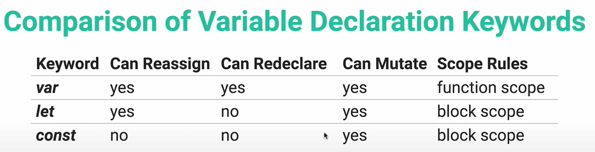

1. String methods

[toFixed](###toFixed)  
[toUpperCase](###toUpperCase)  
[trim](###trim)  
[indexOf](###indexOf)  
[slice](###slice)  
[replace](###replace)  
[parseInt](###parseInt)  
[parseFloat](###parseFloat)
[repeat](###repeat)

6. Math

[Math](###Math)

2. [String_escapes](###String_escapes)

3. Conditional statements

[conditionals](##Conditional_statements)

4. Ternary_operator

[ternary_operator](###Ternary_operator)

5. data types

[dataTypes](##Primitive_data_types)

7. Operators

[logicalOperators](###Logical_operators)  
[operatorsPrecedence](####Operators_precedence)

8. Booleans

[Booleans](###Booleans)

9. [Variables](###Variables)

---

### toFixed

Transforms number into string

```javascript
let averga = (25.344444).toFixed(2);
averga; // "25.34"
```

### toUpperCase

```javascript
let thing = 'asdfgh';
thing.toUpperCase(); // ASDFGH
```

### trim

```javascript
let color = ' purple caqui ';
color.trim(); //removes white spaces at beginning and end of string.
```

### indexOf

```javascript
let pipita = 'hola mi nombre es Pipita';
pipita.indexOf('f'); //-1 (absence of character)
pipita.indexOf('es'); //15
```

### slice

Stores sliced in new variable.

```javascript
let pipita = 'hola mi nombre es Pipita';
let pip = pipita.slice(15);
console.log(pipita); //"hola mi nombre es Pipita"
console.log(pip); // "es Pipita"
let pup = pipita.slice(5, 14); // "mi nombre"
```

### replace

`str.replace("toRemove", "toInclude");`

```javascript
let sor = pipita.replace('Pipita', 'Sorete'); // "hola mi nombre es Sorete"
```

### parseInt

Parse strings into integer number (watch out for NaN.)

```javascript
parseInt('23'); // 23
parseInt('23.34'); //23
parseInt('I ate 3 ramps'); // NaN
parseInt('33cents'); // 33
```

### parseFloat

```javascript
parseFloat('23.43'); //23.43
parseFloat('23'); //23
parseFloat('I ate 3 ramps'); //NaN
parseFloat('33.2cents'); //33.2
```

### repeat

```javascript
'caca'.repeat(3);
// "cacacacacaca"
```

CHAIN METHODS:

```javascript
color.trim().toUpperCase();
```

---

### Ternary_operator

Ternary operator

one `if` and one `else` in a single line of code.

```javascript
a + b ? return/run some : return/run other;
// if A is greater than B ? return this : else runOther.
```

```javascript
let num = 7;
num === 7 ? console.log('lucky') : console.log('bad');

// ternary in variable value:
let status = 'offline';
let color;

let color = status === 'offline' ? 'red' : 'green';
```

---

## Primitive_data_types

- number
  - Integer
  - float
  - NaN (NaN === NaN // false)
- String
- Boolean
- Null
- Undefined

---

### Math

### The Math Object

Collection of pieces of mathematical functionallity.

```javascript
Math.max(7, 3, 9); // 9

Math.min(7, 3, 9); // 3

Math.round(4.9); // 5

Math.floor(3.9); // 3

// Square root:
Math.sqrt(9); // 3

// Absolute value:
// (turns negative into positive)
Math.abs(-456); // 456

// Exponentiation
Math.pow(2, 3); // 8

// Random decimal
Math.random(); // 0.323287457382

// Get a random number between 1 and 88:
Math.floor(Math.random() * 89) + 1; // 32;

// PI
Math.PI; // 3.141592653589793
```

#### operators

In order of precedence:
`()` Parenthesis always runs first.  
`2 ** 2;` & `2 % 2` Exponenciation & modulo
`2 * 2` & `2 / 2` Multiplication and division  
`2 + 2` & `2 - 2` Addition and substraction  
If same precedence, execute from left to right.

`3 - 9 * 2 // -15`
`(3 - 9) * 2; // -12`
`1.5 + 1.5 * 2; // 4.5`
`10 % 6 ** 2; //16`
`200 + 0 / 0; // NaN`

`0` is considered an even number.

### Ternary operators

```javascript
score++; // adds 1
score--; // sustracts 1
score *= 5;
score += 1;
score -= 10;
bonusMult = 100;
score *= bonusMult;
```

---

### Booleans

`true` or `false` values.

### FALSY VALUES:

`false`  
`0`  
`""` (empty string)  
`null`  
`undefined`  
`NaN`
ALL THE REST ARE TRUTHY VALUES.

Check truthyness or falsyness:

```javascript
Boolean(0); // false
Boolean([]); // true

/*the twisted way:*/
!5; // false
!!5; // true
!!0; // false
```

---

### String_escapes

- `\n` : new line
- `\'` : single quote;
- `\"` : double quote;
- `\\` : backslash;

---

### String template literals

Strings that allow embeded information, which will be evaluated and turned into a resulting string.

```javascript
`You owe me ${100 + 53}`;
let animal = 'Pig';
let sound = 'oink';
`${animal} says ${sound.toUpperCase()}!`; // pig says OINK!
```

### `null` & `Undefined`

```javascript
let loggedUser = null; //intentional absence of value. / must be assigned.
let user = undefined; //variables that not have an assigned value.
```

---

### `typeof` operator

```javascript
const userData = 10;
typeof userData; // number
```

### Comparisons

`>` grater than  
`<` less than  
`>=` greater or equal to  
`<=` less or equal to  
`==` equality (of values only)  
`!=` not equal  
`===` strict equality (of vales and type)  
`!==` strict non-equality (value and type)

Strings characters are less or greater than others according to their Unicode values.

    REPL: "read-evaluate-print-loop"

## Conditional_statements

### `if/ else if / else`

```javascript
// Odd number checker:
let num = 36;

if (num % 2 !== 0) {
  console.log('Odd number');
}
```

`else if`  
Will run only one of the conditions.

```javascript
let rating = 2;
if (rating === 3) {
  console.log('Your are a star');
} else if (rating === 2) {
  console.log("You're not a star");
} else if (rating === 1) {
  console.log('Needs improvement');
} else {
  console.log('nothing true before');
}
```

If vs else if.
With `else if`, one of the statements will run:

```javascript
let n = 10;
if (n > 0) {
  console.log('n first time');
} else if (n < 100) {
  console.log('n second time');
} else {
  console.log('not valid');
}
//'n first time'.
```

With `if`, all the true statements will run:

```javascript
if (n > 0) {
  console.log('n first time');
}
if (n < 100) {
  console.log('n second time');
} else {
  console.log('not valid');
}
// 'n first time'
// 'n second time'
```

#### Nested conditionals

Nest conditionals inside conditionals

```javascript
let password;

if (password.length >= 6) {
  if (password.indexOf(' ') === -1) {
    console.log('valid password');
  } else {
    console.log('Password is long enough, but cannot contain spaces');
  }
} else {
  console.log('pwd must be longer');
}
```

### `switch`

One thing to check across multiple variables.

```javascript
// One variable each:
let day = 5;

switch (day) {
  case 1:
    console.log('Monday');
    break;
  case 2:
    console.log('Tuesday');
    break;
  case 3:
    console.log('Wednesday');
    break;
  default:
    console.log('invalid day');
}
// Two or more variables each:
let emoji = 'eggplant';

switch (emoji) {
  case 'sad face':
  case 'happy face':
    console.log('yellow');
    break;
  case 'eggplant':
    console.log('purple');
    break;
  case 'heart':
  case 'lips':
    console.log('red');
    break;
}
```

### Logical_operators

`&&` both sides have to be true to execute

`||` if one side is true, the entire thing is true.

```javascript
let color = ;
if (color === 'blue' || color === 'lilac' || color === 'violet') {
  console.log("gret choice");
}
```

`!` the "not" operator. Returns true if the expression is false. Returns false if the expression is true. "Not true is false".

```javascript
!(3 > 4); // true
!(5 > 4); // false
//If there isn't a logged user:
if (!loggedInUser) {
  console.log("get out of here you're not logged in");
}
```

#### Operators_precedence

Order of execution from first to last:
`()` parenthesis run first.  
`!` run first
`<`  
`<=`  
`>`  
`>=`  
`==`  
`!=`  
`===`  
`!==`  
`&&` run second
`||` run third.  
To alter this order of precedence, add parenthesis.

---

### Include JS code into the html file

Two options:

1. In the html file:

```html
<script>
  <!-- Code goes here>
</script>
```

2. In a separate file. In html:

```html
<script src="app.js"></scriptL>
```

### Variables

Declaration and behavoir

- `var`, can reassign; can redeclare; function scope.  
  When declared outside of a functino, var will be assigned to the window object, for this reason, can override built in objects. Can hoist like hell.
  When compiling the code, the var declarations are runned first, for that reason
  console.log(chickens);
  var chickens = "pat and tim";
  Will throw "undefined" instead of error.

- `let`, (ES2015) can reassign, no redeclare, block scope, can leave it empty;
  Code block is everything between {}, and included brackets are part of that scope :

```javascript
function something() {
  let algo = 'algo';
  if (algo) {
    // can access to "algo" from here.
  }
}
```

Not hoisted when compiling. Doesn't run first.

- `const` (ES2015), no reassign, no redeclare, block scope, can't leave it empty;
  Although, there are ways to reassign values:
  - Primitive data types can be reassigned.
  - To change a ReferenceType (array, object), can keep the same reference but mutate or upate the content of that object or array

```javascript
const myCats = [];
myCats.push('tito');
// ["tito"] Mutated the content of the array, not it's reference.
```



Arrays and objects can use `const` because they references in memory doesn't change, while it's inner elements can change.

### Reccomendations:

1. Don't use var.
2. Always start with const, if it won't work change it to let. Function, object and arrays always with const.
3.
