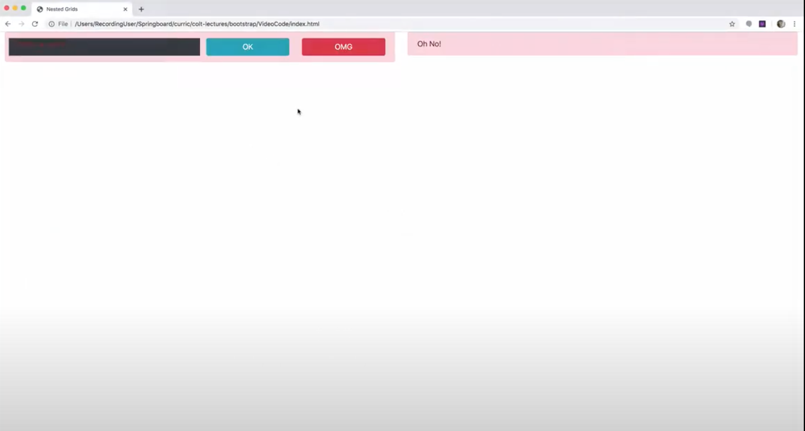

# Bootstrap

Pros:

- grid system
- Columns layouts easy,
- responsive
- nav bar easy
- good looking easy

Cons:

- looks standard if not customized
- you don't learn CSS and media queries

# Remember when using colors:


## setup

1. include the bootstrap files:

   - css link: <link href="https://cdn.jsdelivr.net/npm/bootstrap@5.0.0-beta1/dist/css/bootstrap.min.css" rel="stylesheet" integrity="sha384-giJF6kkoqNQ00vy+HMDP7azOuL0xtbfIcaT9wjKHr8RbDVddVHyTfAAsrekwKmP1" crossorigin="anonymous">
   - JS links if needed (bottom of body, below the local script) <script src="https://cdn.jsdelivr.net/npm/bootstrap@5.0.0-beta1/dist/js/bootstrap.bundle.min.js" integrity="sha384-ygbV9kiqUc6oa4msXn9868pTtWMgiQaeYH7/t7LECLbyPA2x65Kgf80OJFdroafW" crossorigin="anonymous"></script>

2. add classes to elements to manipulate bootstrap properties.

# layout

## grid

### set grid

Grid system very beloved, to make a responsive layout with multiple elements. Rows and columns that are the skeleton for the page, to distribute and
organize space.
[grid](https://getbootstrap.com/docs/5.0/layout/grid/)

1. Always inside a "container" class or "container-fluid"
2. Each row has 12 units of space to divide. (10 and 2, 6 and 6, etc). Can have left over space. If more than 12, content will jump to next row.
3. All columns must be inside a "row" class.

```html
<!-- rows centered in page: -->
<div class="container">
  <div class="row">
    <div class="col-4 bg-danger  text-center"> Col A </div>
    <div class="col-4 bg-warning text-center"> Col B </div>
    <div class="col-4 bg-info text-center"> Col C </div>
  </div>
</div>

<!-- full width, content as in bootstrap website -->
<div class="container-fluid">
  <div class="row">
    <div class="col-2 bg-danger  text-center"> Col A </div>
    <div class="col-8 bg-warning text-center"> Col B </div>
    <div class="col-2 bg-info text-center"> Col C </div>
  </div>
</div>
```

### make grid responsive

Customize breakpoints to change layout according to browser size.
"col-md-4" means "size of column is 4 units of space at the medium size and above".
12 units is full width, divide from there. The higher the number the larger the element.
Default value is extra-small, then go up in size:

```html
<div class="container">
  <div class="row">
    <div class="col-4 col-sm-6 col-md-4 col-lg-3 col-xl-2"> Col A </div>
    <div class="col-4 col-sm-6 col-md-4 col-lg-3 col-xl-2"> Col B </div>
    <div class="col-4 col-sm-6 col-md-4 col-lg-3 col-xl-2"> Col C </div>
    <!-- when screen is medium size each col will take 4 units, when size is large each col will take 3 units and so on -->
  </div>
</div>
```

### auto-layout columns

class "col"
Divide the space evenly between all the elements. Set "col", and BS will divide the cols automatically.

```html
<!-- all same size -->
<div class="container">
  <div class="row">
    <div class="col"> Col A </div>
    <div class="col"> Col B </div>
    <div class="col"> Col C </div>
  </div>
</div>

<!-- a group evenly sized, other group unevenly sized: -->
<div class="container">
  <div class="row">
    <div class="col"> Col A </div>
    <div class="col"> Col B </div>
    <div class="col"> Col C </div>
  </div>
  <div class="row">
    <div class="col"> Left </div>
    <div class="col-10"> Main Content </div>
    <div class="col"> Right </div>
  </div>
</div>
```

### nested grids

Divide content within a column, like this:


Column left with 6 units, column right 6 units. Within column left, two rows, one with full width (12 units) and below that one another row splitted in 6 and 6 for each button.

```html
<div class="container-fluid">
  <div class="row">
    <div class="col">
      <div class="alert alert-danger">
        <div class="row">
          <div class="col-6 bg-dark"> This is an alert! </div>
          <div class="col">
            <button class="btn btn-info btn-block">OK</button>
          </div>
          <div class="col">
            <button class="btn btn-danger btn-block">OMG</button>
          </div>
        </div>
      </div>
    </div>
    <div class="col">
      <div class="alert alert-danger"> Oh No! </div>
    </div>
  </div>
</div>
```



### columns alingment

[alignment](https://getbootstrap.com/docs/5.0/layout/columns/)
Add classes to rows to align content. BS uses flexbox terminology to align content.
Alingment classes go on the row class.
"align-items" vertical align.
"align-self-start" aligns a column individually, the class is added to the column, not to the row. start/center/end

"justify-content" horizontal align.

"justify-content-around" (refers to the extra space, "spread the extra space around the elements")
"justify-content-between" (extra space between elements, elements pushed to the edges);
"justify-content-evenly"

---

# Components

## titles

[typographTitles](https://getbootstrap.com/docs/5.0/content/typography/)

```html
<h1>h1. Bootstrap heading</h1>
or
<h1 class="display-1">Display 1</h1>
or:
<p class="h1">h1. Bootstrap heading</p>
```

[fullTypography](https://getbootstrap.com/docs/5.0/content/typography/)

## buttons

"btn" class gets rid of browser defaults for buttons, "btn-primary", etc applies bootstrap color.  
[colors](https://getbootstrap.com/docs/5.0/customize/color/).

```html
<button class="btn btn-primary">Click me</button>
<button class="btn btn-info">Click me</button>
<button class="btn btn-success">Click me</button>
<button>No bootstrap</button>

<!-- outline  (color fills in when hover)-->
<button class="btn btn-outline-success">Click me</button>

<!-- Anchor tag as button: -->
<a href="" class="btn btn-info">I am an anchor tag</a>

<!-- input as button -->
<input type="button" value="Input" class="btn btn-danger" />
```

## images

[images](https://getbootstrap.com/docs/5.0/content/images/)

```html
<!-- loose in page -->


<!-- contained: -->
<div class="container">
  
</div>
```

## card

[card](https://getbootstrap.com/docs/5.0/components/card/)
Inline style attr to manually set size of image, not good practice, better set it up dinamically with the grid and get rid of style here.

```html
<div class="card" style="width: 18rem;">
  
  <div class="card-body">
    <h5 class="card-title">Card title</h5>
    <p class="card-text"
      >Some quick example text to build on the card title and make up the bulk
      of the card's content.</p
    >
    <a href="#" class="btn btn-primary">Go somewhere</a>
  </div>
</div>
```

## badges

[badge](https://getbootstrap.com/docs/5.0/components/badge/)

```html
<h1>Example heading <span class="badge bg-secondary">New</span></h1>
```

## alerts

[alert](https://getbootstrap.com/docs/5.0/components/alerts/)
"role" property is for accessibility.

```html
<div class="alert alert-primary" role="alert">
  A simple primary alert—check it out!
</div>

<!-- alert with link inside: -->
<div class="alert alert-primary" role="alert">
  A simple primary alert with
  <a href="#" class="alert-link">an example link</a>. Give it a click if you
  like.
</div>
```

## jumbotron

Removed from v5

```html
<div class="container">
  <div class="jumbotron">
    <h1 class="display-3">Welcome!</h1>
  </div>
</div>
```

## forms

[forms](https://getbootstrap.com/docs/5.0/forms/overview/)

"form-control" class styles all kind of inputs

## navbar

[navbar](https://getbootstrap.com/docs/5.0/components/navbar/)

## tooltips

Displays when hovering over an element. Uses javascript. Takes two steps:

1. html from docs:

```html
<button
  type="button"
  class="btn btn-secondary"
  data-bs-toggle="tooltip"
  data-bs-placement="top"
  title="Tooltip on top"
>
  Tooltip on top
</button>
```

2. Enable it in javascript:

```javascript
var tooltipTriggerList = [].slice.call(
  document.querySelectorAll('[data-bs-toggle="tooltip"]')
);
var tooltipList = tooltipTriggerList.map(function (tooltipTriggerEl) {
  return new bootstrap.Tooltip(tooltipTriggerEl);
});
```

### popovers

Similar ways of tooltips. Insert the html and activate it with the javascript provided in docs.

# Containers

We use them to wrap around content to center it and to give it
space around. BS containers are fully responsive
[containers](https://getbootstrap.com/docs/5.0/layout/containers/) ```html

<div class="container">
  <!-- Content here -->
</div>

<!-- full width container -->
<div class="container-fluid"> ... </div>
````

---

# utilities

Borders, colors, etc.
[utilites](https://getbootstrap.com/docs/5.0/utilities/borders/)

### borders

Add "border-top", etc. Sustract borders: "border-top-0".

```html
<div class="col-3 border-left border-right border-danger"></div>
```


### spacing

[spacing](https://getbootstrap.com/docs/5.0/utilities/spacing/)  
Margin and padding short syntax:
{property}{sides}-{size} // default xs screen size
{property}{sides}-{breakpoint}-{size} // sm, md, lg, xl, xxl screen sizes.

- "m" for margin (all sides)
- 'p' for padding. (all sides)
  Check full syntax on doc.
- sizes 0 to 5.

```html
<button clas="btn p-0 m-3"></button>
```

### display

Manages the CSS "display" property. "none" hides it in certain screen sizes.
"d-{value}" for xs.
"d-{breakpoint}-{value}" for sm, md, lg and xl.

"Hide image in sm and xs, show it in md size and above:"

```html
<div class="col d-none d-md-inline">
  
</div>
```

# font awesome

fontawesome is a library of icons.
Setup:

1.

```html
<link
  rel="stylesheet"
  href="https://cdnjs.cloudflare.com/ajax/libs/font-awesome/5.15.1/css/all.min.css"
/>
```

2. Choose icon and paste it .

---

# Customize bootstrap

- Tools to download a ready made theme (https://bootswatch.com)
- Tools to make your own bootstrap theme: https://themestr.app (pick your theme, download the css file at the bottom of page, save it in project folder and link that stylesheet in your html file (<link rel="stylesheet" href="theme1.css">). First work on the plain bootstrap, link this afterwards.)

# Other frameworks

- Foundation (https://get.foundation)
- https://semantic-ui.com
- https://bulma.io (newest)
