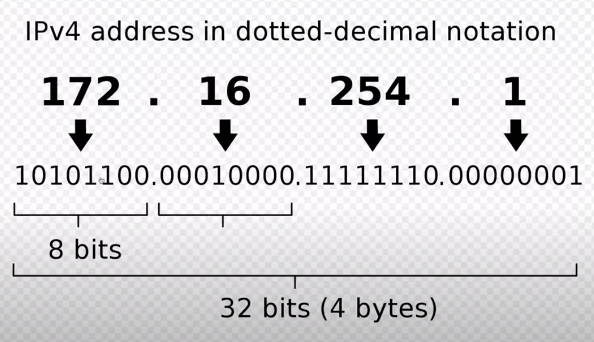

# Web

[notes](images/web.webarchive)

## IP Addresses

127.0.0.1 is always the local computer you're on (localhost)

[mdn](https://developer.mozilla.org/en-US/docs/Learn/Common_questions/How_does_the_Internet_work)
To comunicate with each other, computers use the ROUTER, which is "a tiny computer that has only one job: it makes sure that a message sent from a given
computer arrives at the right destination computer.So a given computer sends the message to the router, that which in turn forwards the message to the required destination".
The IP address is a unique address that corresponds to a computer on a network. Each computer of the network is identifies by its IP.

IPv4 version:

- Four numbers separed by dots.
- Each numbers between 1 and 255
  

IPv6 (more bits allowed, so more combinations)

we can't remember an IP, that's why we use:

## Hostnames

A human readable name that comunicates with an IP Address. When typing "google.com" that will be resolved into a corresponding IP Address. For this translation
from hostname to IP, computer uses the DNS.
Localhost is always 127.0.0.1

## DNS

Domain Name System. Is the phonebook for the web. Takes the hostname and translates it into the corresponding IP Address. Can do reverse lookups too.
When typing a hostname, the browser checks: Computer cache -> Router -> ISP -> DNS Servers. Returns the IP where it first finds it, or Error Not Found.
"dig" in terminal to check details of specific requests.
127.0.0.1 reserved for local computer.

## URL

Universal Resource Locator. Used for web or for ftp or database. It's components:

1. Protocols (most common):
   - http (Hypertext Transfer Protocol), how servers comunicate
   - https (secure, servers comunicate with encryption)
   - ftp (File Transfer Protocol)
2. Hostname (google, etc)
3. Ports. Every server has 65535 unique ports you can communicate with. Servers tend to have a default port,
   - for http, the default port is 80. (http://www.wikipedia.org:80)
   - for https, the default port is 443. (https://www.wikipedia.org:443)
4. Resource. Specifies what resource we're asking for, in the multiplicity of files the server has. What file or type of files do we want. Usually servers
   has a logic that looks at the resource part to return the response. (https://developer.mozilla.org/en-UK/)
5. Query. It's optional. Provides "extra information" about the URL. Usually is for search terms. (https://developer.mozilla.org/en-UK/search?q=rainbow). The
   Query strings are preceded by "?" and separated by "&", with this form: "?x=1&y=2".

## HTTP Request and HTTP Response

A server is a computer that provides functionality for other devices. There are many types of servers. In development, mostly we talk about Web Servers.

Browser and server flow:

The browser and the server communicates through HTTP. A protocl is a set of rules about how something must be done. Specifies how information must be structured in order to be readable by the other part.

1. Request contains:

   - Method (GET, POST, etc)
   - HTTP Protocol version (almost always is 1.1)
   - Resource URL that you want.
   - Headers (depends on each server):
     - Hostname
     - Date your browser think it is
     - Language the browser wants
     - Any cookies the server has sent
     - more (full list of headers in "network" tab of chrome console.)

2. Response contains:
   - HTTP protocol version (mostly 1.1)
   - Response Status Code (200, 404, etc)
   - Headers:
     - Content Type (typically text/html for web pages)
     - Date/time the server thinks it is
     - Any cookies server wants to set
     - Any caching information
     - more (full list of headers in "network" tab of chrome console.)

Response codes:

- 200: ok
- 301: moved permanently (all 3 hundreds are Redirect)
- 304: not modified
- 404: not found
- 500: server had internal problem.

[full_list](https://developer.mozilla.org/en-US/docs/Web/HTTP/Status)

## GET and POST

[checking_tool](https://pipedream.com/workflows)

When we send a request, we can specify a method.

1. GET.

   - Requests without side effects (don't change server data, don't save nor erase). Used only to retrieve information.
   - Arguments are passed in query string.
   - Are generated when entering a URL in a browser, clicking a link, and some form submissions.

2. POST. Has side effects. Save data in database, or a post in instagram. The information is sent to be saved somewhere.
   - Arguments are sent as the body of the request.
   - Are generated in some form submissions, never entering URL in browser.

## Multiple requests

The CSS, the html docs, the images, all the different data of a site needs a separate request to be rendered. The browser does the job of sending a request per each one of the links in the document and rendering the results together. Those links are in the html (<link href="stylesheet">), etc. Each link makes the request on the browser to ask for that content to the server. For every link you have, a separate request will be sended from the browser to retrieve that content. That's why companies care about how many resources they have in their pages (a lot of small scripts, or one big script, or css files, or images. Usually you don't want too many requests to be made, there's a lot of optimization to make in order to load only what's necessary or in the most efficient way.) Browser issues these requests asynchronously, they'll assemble the final result as requests come back. Check the process in chrome's network tab.

## Setup a server

Build a server to render .html files and other things with http protocol, so you can test and do stuff before hosting it somewhere.

1. With python:
   - In terminal, cd to project's folder, and from there:
   - `python3 -m http.server`
   - Use the provided url in browser to access the files.
2. With VSCode: just open project's folder and launch Live Server extension.

The files will be served with an HTTP server, instead of being opened by a file protocol.

## Network

A set of computers that comunicate. The internet is a really big network.
The Internet is the network of computers (used in many ways).  
The World Wide Web is one part of the Internet. Is one information system of the Internet.
