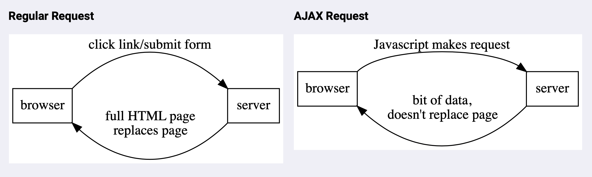

Libraries to use AJAX:

1. ## Axios

1. Setup:

- include cdn link (before the app.js file): `<script src="https://cdnjs.cloudflare.com/ajax/libs/axios/0.21.1/axios.min.js"></script>`
- type "axios" in console, if it doesn't throw error you're good to go.

2. Single GET request:

```javascript
async function getPosition() {
  const response = await axios.get('http://api.open-notify.org/iss-now.json');
  console.log(response.data.iss_position);
  console.log('this line runs after axios.get');
}

getPosition(); // {longitude: "145.0975", latitude: "28.4226"} "this line runs after axios.get"

async function getStarWarsPlanets() {
  const response = await axios.get('https://swapi.dev/api/planets');
  for (let planet of response.data.results) {
    console.log(planet.name);
  }
}

getStarWarsPlanets(); // Tatoonie, Alderaan, Yavin, Hoth, Dagobah
```

3. Multiple GET requests:

```javascript
async function getPlanetsByPage() {
  const response1 = await axios.get('https://swapi.dev/api/planets');
  // get planets of page 1, only their names:
  for (let planet of response1.data.results) {
    console.log(planet.name);
  }
  // grab "next" property from the response, and get the planets names of the page 2:
  const response2 = await axios.get(response1.data.next);
  for (let planet of response2.data.results) {
    console.log(planet.name);
  }
}

getPlanetsByPage(); // Geonosis, Utapau, Mustafar, ....
```

Axios parses the JSON response into a JavaScript object automatically, so we can work with it right away.

4. Error Handling
   If a request doesn't work, or if an API is down or doesn't respond,
   use try/catch:

```javascript
async function getDogByBreed(breed) {
  try {
    const url = `https://dog.ceo/api/breed/${breed}/images/random`;
    const res = await axios.get(url);
    const linkImage = res.data.message;
    document.querySelector('#dog-by-breed').setAttribute('src', linkImage);
  } catch (e) {
    console.log(e);
    alert('breed not found');
  }
}
```

5. GET params

- params:

```javascript
// Syntax:
axios.get('http://ApiURL', { params: { param1: value1, param2: value2 } });

// Example:
// API: http://api.icndb.com/jokes/random?firstName=John&lastName=Doe
async function getJoke(firstName, lastName) {
  const res = await axios.get('http://api.icndb.com/jokes/random', {
    params: { firstName, lastName },
  });
  console.log(res.data.value.joke);
}
getJoke('Juan', 'Domingo'); // Juan Domingo can read from an input stream.
```

6. POST requests

```javascript
// Syntax:
axios.post(url, [data], [config]);

// Example:
// API: reqres.in
async function createUser() {
  const res = await axios.post('https://reqres.in/api/users', {
    userNickName: 'Sorongo',
    email: 'caca@caca.com',
    age: 21,
  });
}

createUser(); /* 
status: 201,
data:
    age: 21
    createdAt: "2021-01-05T15:31:15.606Z"
    email: "caca@caca.com"
    id: "850"
    userNickName: "Sorongo" */
```

2. fetch

3. ## XMLHttpRequest

Uses callbacks, just as a setTimeout.
(XHR for short)
Old tool for making requests from Javascript.
[docs](https://developer.mozilla.org/en-US/docs/Web/API/XMLHttpRequest)

```javascript
const firstReq = new XMLHttpRequest();
firstReq.addEventListener('load', function () {
  console.log(this.responseText);
});

firstReq.addEventListener('error', () => {
  console.log('Error!!!!!');
});

firstReq.open('GET', 'https://swapi.co/api/planets/');
firstReq.send();
```

4. Other libraries (jQuery, etc)

---

# AJAX

Asynchronous Javascript And Xml.
Start server before making requests.
AJAX requests are asynchronous.

It's a way to structure the interaction between codes.
Why to use it:

- Don't need to reload the entire page is something minor is changing.
- Interactive websites, the experience for the user is clean, doesn't have to go through a bunch of webpages and click on things. Stay on the same page and see content change.
- Fewer page loads from server.
- Less info goes accross the network.

Why not to use it:

- Harder to make accessible webistes (screen readers have a hard time understanding it, use Aria for this).
- Slower internet can make the user have an odd experience, since the requests happen without a "submit" button.
- Since search engines use the hmtl content to index sites, having less html can make it harder for SEO.

Making requests via JavaScript, in the browser, without the page refreshing.

1. Traditional browser requests, the browser makes the request, receive the response, replaces the entire resource with the new content. This happens when:

   - Entering a URL in the address bar
   - Clicking on a link
   - Submitting a form.

2. AJAX web request:
   - Made from Javascript in browser
   - Javascript makes request (GET, POST, etc)
   - You receive a response
   - Do whatever you want with the result (in general show the data to the user)



# Promises

A promise is like a placeholder for a future value. Represents something that doesn't have a value at the moment but will eventually have some value or hold an error. Requests takes time, they don't happen inmediately, that's why we work with promises, so javascript don't have to pause the execution to wait, can keep executing while the promised value is being processed by the browser.
Axios doesn't return the value inmediately, it returns a Promise. In order to access the values, we use async and await.

## async_await

async / await
Pair of keywords, we use ASYNC to declare a function as asynchronous function. Use AWAIT keyword inside async functions. AWAIT will pause the execution OF THE FUNCTION ONLY, till the value is resolved, in the meantime javascript will execute the code OUTSIDE of the function, and when de awaited value is resolved by the browser, javascript will store the value in variable, and then run the rest of the code inside the function.

---

# API

Application Programming Interface. Interface for the code to interact with other code or applications. Different kind of APIs to communicate with robots, with servers, etc.
Companies provide APIs to retrieve data from them, or to send data.

Web based APIs are available through requests.

## Data formats

The interface for code is different from the interface for a human. When we browse on the web, we make HTTP requests and get HTML back. But HTML has a lot of page structure information, so APIs don't respond with HTML, because they respond with data.

### JSON

Javascript Object Notation. Single quotes don't work.
Can convert JSON object to JavaScript object.

```json
{
  "person": {
    "name": "Elie",
    "favoriteColor": "purple",
    "city": "San Francisco",
    "favoriteNumber": -97,
    "interests": ["CEOing", "eating Mediterranean food"],
    "futureDreams": null
  }
}
```

### XML

Similar to HTML, except tags are custom. It's an old format.

```xml
<person>
  <name>Elie</name>
  <favoriteColor>purple</favoriteColor>
  <city>San Francisco</city>
</person>
```

## curl

Tool to make requests to APIs. (Check terminal.md for commands)

## Documentation

APIs documentation are basically a bunch of HTTP request endpoints where we send a request to.
Usually they will have a BASE URL and then different endpoints.
`http://www.BASEURL.com/ENDPOINTS`
