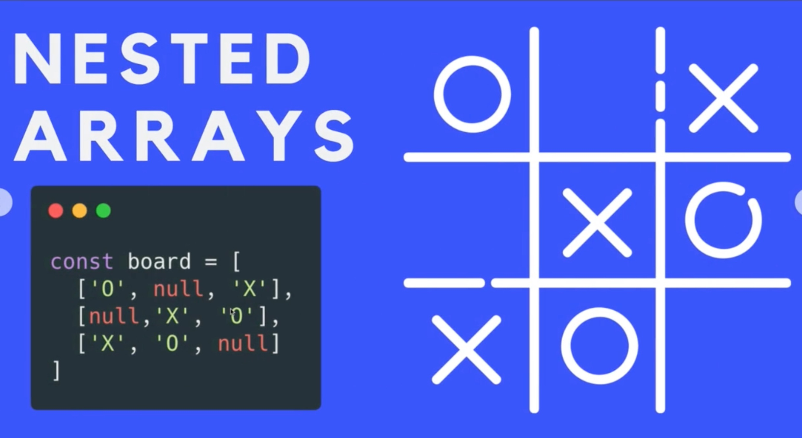

## Arrays

### Array methods

[push()](##push) (add to the end).
[pop()](##pop) (remove from end & return value)
[unshift()](##unshift) (add to start).
[shift()](##shift) (remove from start).

[Array.from](##Array.from)  
[reduce](##reduce)
[find](##find)  
[findIndex](##findIndex)
[every](##every)  
[some](##some)  
[filter](##filter)  
[map](##map)
[forEach](##forEach)

[concat()](##concat) (merge arrays).
[includes()](##includes) (check if value exists, returns `true` or `false`)
[indexOf()](##indexOf) (idx pos, `-1` if not present.)
[lastIndexOf()](##lastIndexOf) (last idx pos, `-1` if not present.)
[reverse()](##reverse) (overwrite array, reversing it).
[join()](##join) (takes arr and spits single string).
[slice()](##slice) (Takes portion of arr and makes new arr with it).
[splice()](##splice) (modify middle of arr).
[sort()](##sort) (updates arr and return it, can capture in new var).

Complex data structures built in javascript.  
Ordered collections of values.

`let students = ["toto", "caco", "pepino", "roberto", "josecito"];`

### Access items in array:

```javascript
let colors = ['red', 'orange', 'yellow', 'green'];
colors.length; // 4
colors[colors.length - 1]; // "green"
colors[4]; // Undefined
colors[0]; // 'red'
```

### Modify array:

Since arrays are mutable, can assign new value:

```javascript
// change value (ovewrite previous value):
colors[0] = 'purple';
// add item:
colors[4] = 'lila';
// add item at the end:
colors[colors.length] = 'black';
```

## Array methods

[array methods full list here](https://developer.mozilla.org/en-US/docs/Web/JavaScript/Reference/Global_Objects/Array)

---

## Array.from

Pass an array-like object (a nodelist, and HTMLCollection, anything iterable), and it will turn it into an actual array.

```javascript
const links = Array.from(document.querySelectorAll('a'));
links; // [link1, link2, link3];
```

## reduce

Take an array with multiple values and reduce them to a single value.

## find

Only returns the first match.
iterates over array, runs callback in each item, if callback true at any point, return the value in the array, if doesn't find element that matches callback condition, returns undefined.

```javascript
const scores = [1, 46, 78, 100];
scores.find(function (score, index, array) {
  return score > 45;
}); // 46
```

## findIndex

Run callback, if element returns true, returns index position of that element. If elements doesn't exist, returns `-1`;

```javascript
scores.findIndex(function (score, index, array) {
  return score > 45;
}); // 1
```

## every

Returns boolean. Returns true if every single element in the callback returns true. If one value returns false, the whole function returns false.

```javascript
let isShort = words.every(function (value, index, array) {
  console.log(index); // 0 1 2
  console.log(array); // ["fdsafsd", "fdsfdsfsdfsdfsdf", "fd"]
  return value.length >= 5;
});

console.log(isShort); // false
//----------------------------------------
function allStrings(arr) {
  return arr.every(function (val) {
    return typeof val === 'string';
  });
}

console.log(allStrings(words)); // true
```

## some

Returns only a boolean. Returns true If callback returns true for at least one single value.
Is a way to check if there is some element in an array that pass a given condition.

```javascript
const words = ['fdsafsd', 'fdsfdsfsdfsdfsdf', 'fd'];

let isLong = words.some(function (word, index, array) {
  return word.length > 25;
});

isLong; // false
```

## filter

Creates new array. Loops through given array. Runs callback function on each value of given array. If callback function true: the value is pushed in new array, if false: not pushed. Original array not mutated.

```javascript
let letters = ['a', 'b', 'c', 'b', 'c'];

let filtered = letters.filter(function (value, index, array) {
  return value === 'b' || value === 'c';
});

filtered; //  ["b", "c", "b", "c"]
```

## map

Loops over array, runs callback function on each item of array, and returns a new array of the same length. Make sure function returns something.
Arguments are optional.
Used when there's a need of duplicating an array, without modifying the original.

```javascript
let numbers = [1, 2, 3];

const tenths = numbers.map(function (value, index, array) {
  return value * 10;
});
tenths; // [10, 20, 30];
numbers; // [1 ,2, 3]
```

Map over an object:

```javascript
const todos = [
  {
    id: 3,
    text: 'walk the dog',
    priority: 'high',
  },
  {
    id: 2,
    text: 'park car',
    priority: 'low',
  },
];

const todoText = todos.map(function (todo) {
  return todo.text;
});

todoText; // ["walk the dog", "park car"]
```

## forEach

Returns UNDEFINED always (no matter what)
The goal of this is call some function for every item in an array.
For of is newer and maybe better.

````javascript
const colors = ['teal', 'cyan', 'peach', 'purple'];

colors.forEach(function (val, index, arr) {
  console.log(`At index ${index} is color ${val}`);
});
/*
At index 0 is color teal
At index 1 is color cyan
At index 2 is color peach
At index 3 is color purple
*/
```

## `push()`

Add item to end of list.

```javascript
colors.push('onion-white');
colors.push('gray', 'darkie');
````

## `pop()`

- `pop()` remove from end and returns the value

```javascript
colors.pop(); // "onion-white" and removes item.
```

## `unshift()`

- `unshift()` add to start

```javascript
let dishesTodo = [];
dishesTodo.unshift('large plate');
dishesTodo.unshift('spoon', 'knife');
```

## `shift()`

- `shift()` remove from start

```javascript
dishesTodo.shift();
```

## `concat()`

- `concat()`
  `arr1.concat(arr2, arr3);`

```javascript
let fruits = ['apple', 'banana'];
let vegs = ['potato', 'brussel'];
let meat = ['stake', 'chicken'];
let all = fruits.concat(vegs, meat);
```

## `includes()`

- `includes()`  
  check if value exists, returns `true` or `false`

```javascript
meat.includes('chicken'); // true
//
if (all.includes('stake')) {
  console.log("I'm vegetarian, can't eat that");
}
```

## `indexOf()`

- `indexOf`  
  Checks index position of element, `-1` in case element not present.

```javascript
fruits.indexOf('apple'); // 0
fruits.indexOf('fdffdfd'); // -1 (meaning that element doesn't exist in array)
fruits.indexOf('banana', 2); // search from index 2 and on.
```

## lastIndexOf

Las index position of element, `-1` if not exist.

```javascript
const arr1 = ['a', 'c', 'a'];
arr1.lastIndexOf('a'); // 2
```

## `reverse()`

- `reverse()`
  Reverses array, mind it modifies array!

```javascript
let letters = ['g', 'a', 's', 't', 'o', 'n'];
letters.reverse(); // letters = ["n", "o", "t", "s", "a", "g"]
```

## `join()`

- `join()`
  Takes array and spits out a single string with all the elements of the string.

```javascript
letters.join(); // "g,a,s,t,o,n" (default character is `,`)
letters.join(''); // "gaston"
letters.join('&'); // "g&a&s&t&o&n"
```

## `slice()`

- `slice()`
  Takes portion of array and makes new array with it.

```javascript
let animals = ['shark', 'salmon', 'whale', 'bear', 'lizard', 'tortoise'];
let swimmers = animals.slice(0, 3); //from`0`(included), to `3`(not included)
let mammals = animals.slice(2, 4);
let reptiles = animals.slice(4); //from index `4` to the end of array.
let quadruped = animals.slice(-3); // negative numbers counts from end to beginning.
let reverse = animals.slice(-4); // last four elements
let reverse1 = animals.slice(-3, -1); // ["bear", "lizard"]
let duplicate = animals.slice(); // duplicates array and stores it in given variable.
```

## `splice()`

- `splice()`
  Modify the middle of array. Syntax:
  `splice(startIndex, deleteCount, itemsToInsert);`

```javascript
// INSERT elements
// "at index 1, delete 0 items and insert "octopus"'
animals.splice(1, 0, 'octopus'); // ["shark", "octopus", "salmon", "whale", "bear", "lizard", "tortoise"]

// DELETE elements
// 'at index 5, delete 2 items'
animals.splice(5, 2); // ["shark", "octopus", "salmon", "whale", "bear"]

// REPLACE elements
// 'at index 3, delete 2 items and replace them with "orca" and "grizzly"
animals.splice(3, 2, 'orca', 'grizzly'); // ["shark", "octopus", "salmon", "orca", "grizzly"]
```

## `sort()`

- `sort()`  
  Updates array and returns it, can capture that in a new variable. In strings, sorts alphabetically. In numbers, converts numbers to strings and sorts them according to their UTF Code. So people pass a function to tell the method how to sort. Syntax:
  `arr.sort([compareFunction]);`
  ```javascript
  let people = ['beto', 'carlos', 'aldo', 'daniel'];
  people.sort(); // ["aldo", "beto", "carlos", "daniel"]
  ```

### Reference types

`Value type variables` are stored in memory (`let color = "red";`). Javascript assigns a slot in memory for that value.

```javascript
let nums = 10;
let pipo = nums; // meaning `10`
nums = 11; // updated value.
pipo; // 10 (desn't update it's value)
```

`Reference type variables`: With arrays, as they're complex, JS stores a reference to that array. JS holds a pointer to where the array is stored. Same thing happens with objects.

```javascript
let chucha = [20, 30, 40];
let papa = chucha; // 20, 30, 40
chucha.push(50);
papa; // [20, 30, 40, 50] (Updates values, because arrays are stores as references pointing to the data collection, so when we modify the collection, any time we call the reference pointing to that collection we will get the modifications.)
```

Since we're not modifying the reference, we can use `const` with arrays and update it's items.

```javascript
const eggs = ['humpty', 'dumpty'];
eggs.push('carlos');
eggs; // ["humpty", "dumpty", "carlos"]
```

Can't change the reference thoug:

```javascript
eggs = ['lila', 'lola']; // throws error because we're trying to assign another array to the already bussy reference `eggs`.
```

## Nested Arrays / Multidimensional Arrays

```javascript
const colors = [
  ['red', 'crimson'],
  ['orange', 'dark orange'],
  ['yellow', 'golden rod'],
];
// Access the data:
colors[0][1]; // "crimson"
colors[1][0]; // "orange"
```

Two dimensional array:



Three lines with three elements in each line, all nested in a main array.

Three dimensional array:

```javascript
const animalPairs = [
  ['doe', ['buck', 'stag']],
  ['ewe', 'ram'],
  ['peahen', 'peacock'],
];
// Access nested item:
animalPairs[0][1][0]; // "buck"
```
