- Abstract data types
  1. TREES
     - [trees](#trees)
     - [trees_in_javascript](##trees_in_javascript)
     - [binary_trees](##binary_trees)
       BINARY SEARCH TREES
     - [BSTs](##binary_search_trees)
     - [javascript_implementation_BST](##javascript_implementation_BST)
  1. MAPS
     - [maps](#maps)
  1. HASH TABLES (HASH MAPS)
     - [hash_tables](#hash_tables)
     - [hash_tables_runtime](##hash_tables_runtime)
     - [hashing](###hashing)
     - [hash_runtime](###hash_runtime)
     - [collisions](###collisions)
     - [cool_article_tables](https://medium.com/basecs/taking-hash-tables-off-the-shelf-139cbf4752f0)
     - [cool_article_hashing_functions](https://medium.com/basecs/hashing-out-hash-functions-ea5dd8beb4dd)
  1. STACKS
     [stacks](#stacks)
     - [constraints](#Constraints_stacks)
     - [methods](##Standard_methods_stacks)
     - [implementations](##Efficient_Implementations_stacks)
     - [example](####Example_implementation_stacks)
     - [cool_article](https://medium.com/basecs/stacks-and-overflows-dbcf7854dc67)
  1. QUEUES
     [queues](#queues)
     - [constraints](#Constraints_queues)
     - [methods](##Standard_methods_queues)
     - [implementations](##Efficient_Implementations_queues)
     - [example](#Example_implementation_queues)
     - [cool_article](https://medium.com/basecs/to-queue-or-not-to-queue-2653bcde5b04)
  1. DEQUES
     [deques](#deques)
     - [constraints](#Constraints_deques)
     - [methods](##Standard_methods_deques)
     - [implementations](##Efficient_Implementations_deques)
     - [example](#Example_implementation_deques)
  1. HEAPS
     [heaps](#heaps)
     - [constraints](#Constraints_heaps)
     - [methods](##Standard_methods_heaps)
     - [implementations](##Efficient_Implementations_heaps)
     - [example](#Example_implementation_heaps)
     - [cool_article](https://medium.com/basecs/learning-to-love-heaps-cef2b273a238)
  1. PRIORITY QUEUES
     [priority_queues](#priority_queues)
     - [constraints](#Constraints_P_queues)
     - [methods](##Standard_methods_P_queues)
     - [implementations](##Efficient_Implementations_P_queues)
     - [example](#Example_implementation_P_queues)
  1. LISTS
     [lists](#lists)
     - [linked_lists](##linked_lists)
       - [LLists_runtime](#runtime_ll)
     - [doubly_linked_lists](##douubly_linked_lists)
     - [Nodes](##Nodes)
  1. ARRAYS
     - [arrays](##arrays)
     - [array_runtimes](###array_runtimes)
     - [indirect_arrays](###indirect_arrays)
     - [direct_arrays/vectors](###direct_arrays/vectors)
     - [typed_arrays](###typed_arrays)
- Recursion
  [recursion](#recursion)
  [examples](##examples)
  [runtime](##runtime)
  [explicit_base_case](###explicit_base_case)
  [hidden_base_case](###hidden_base_case)
  [degenerate_case](###degenerate_case)
  [recursion_vs_loops](##recursion_vs_loops)
- Divide and Conquer Strategy
  [examples](##examples)
  [binary_search](##binary_search)
  [linear_search](##linear_search)
- Big-O notation
  [functions](##functions)
  [time_complexity](##time_complexity)
  [time_complexity](##space_complexity)
  [log](##log)
  [generalities](##generalities)

# Abstract data types

<a name="stacks"></a>

# trees

A main structure (root node) that branches in smaller branches till an end. A top node has child nodes, arranged in a hierarchical order, WITH ONE ROOT NODE AT THE TOP. EACH NODE CAN HAVE ONLY ONE PARENT.
Tree elements:

- Node (basic unit of the tree).
- Children (nodes directly below a node)
- Descendants (nodes below a node)
- Parent (node that is directly above a node)
- Ancestor (node that is above a node)
- Root Node (node at the top of the tree)
- Leaf Node (node without any children)

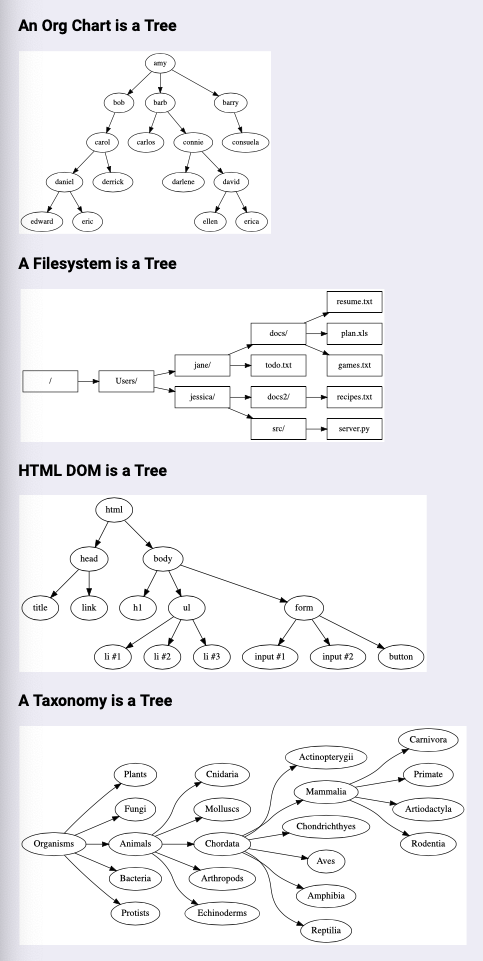

"n-ary tree": no constraints in how many children nodes can have.
"binary tree": nodes can have 0, 1, or 2 children only.

## trees_in_javascript

Mind we implement the find methods on the Nodes, because each node is it's own tree.

```javascript
class Node {
  constructor(val, children = []) {
    this.val = val;
    this.children = children;
  }

  // Depth First Search:
  // transvers the tree in depth direction first, then in broadth.
  // usses a stack (add at the top, remove from the top. the top of the stack is at the right of the array).
  findDFS(val) {
    const toVisitStack = [this]; // Node {val: "carlos", children: Array(2)} in our example.
    while (toVisitStack.length) {
      const current = toVisitStack.pop(); // remove from toVisitStack and store it in current
      if (current.val === val) {
        return current;
      }
      for (let child of current.children) {
        // push the children in the toVisit stack
        toVisitStack.push(child);
      }
    }
  }

  // Breadth First Search
  // transverse the tree in broadth direction first, then in depth.
  // uses a queue (first in first out, first element is at the left of array)
  findBFS(val) {
    const toVisitQueue = [this];
    while (toVisitQueue.length) {
      const current = toVisitQueue.shift();
      if (current.val === val) {
        return current;
      }
      for (let child of current.children) {
        toVisitQueue.push(child);
      }
    }
  }
}

let carlos = new Node('carlos', [new Node('tito'), new Node('pucho')]);
/**
 Node {val: "carlos", children: Array(2)}
children: (2) [Node, Node]
val: "carlos"
 */

carlos.findDFS('pucho'); // Node {val: "pucho", children: Array(0)}

// Can use a class to store the root:

class Tree {
  constructor(root) {
    this.root = root;
  }

  findInTreeDFS(val) {
    return this.root.findDFS(val);
  }

  findInTreeBFS(val) {
    return this.root.findBFS(val);
  }
}

const players = new Tree('carlos');
players.findInTreeDFS('tito');

// -----------------------------------------------------------------
// ALTERNATE SYNTAX:

class Node {
  constructor(val) {
    this.val = val;
    this.children = [];
  }
}

let amy = new Node('amy');
let bob = new Node('bob');
let barry = new Node('barry');

amy.children.push(bob);
amy.children.push(barry);
// now we have a tree composed by 3 nodes:
/**
Node {val: "amy", children: Array(2)}
children: (2) [Node, Node]
val: "amy" */
```

## binary_trees

A tree where a node can have 0, 1, or 2 children.

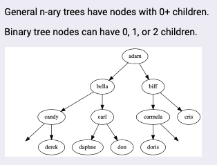

Usually they're implemented with _left_ and _right_ properties, rather than children:

```javascript
/** BinaryTreeNode: node for a general tree. */

class BinaryTreeNode {
  constructor(val, left = null, right = null) {
    this.val = val;
    this.left = left;
    this.right = right;
  }
}

class BinaryTree {
  constructor(root = null) {
    this.root = root;
  }

  /** minDepth(): return the minimum depth of the tree -- that is,
   * the length of the shortest path from the root to a leaf. */

  minDepth() {
    if (!this.root) return 0;

    function minDepthHelper(node) {
      if (node.left === null && node.right === null) return 1;
      if (node.left === null) return minDepthHelper(node.right) + 1;
      if (node.right === null) return minDepthHelper(node.left) + 1;
      return (
        Math.min(minDepthHelper(node.left), minDepthHelper(node.right)) + 1
      );
    }

    return minDepthHelper(this.root);
  }

  /** maxDepth(): return the maximum depth of the tree -- that is,
   * the length of the longest path from the root to a leaf. */

  maxDepth() {
    if (!this.root) return 0;

    function maxDepthHelper(node) {
      if (node.left === null && node.right === null) {
        return 1;
      }
      if (node.left && node.right) {
        return (
          Math.max(maxDepthHelper(node.left), maxDepthHelper(node.right)) + 1
        );
      }
    }

    return maxDepthHelper(this.root);
  }

  /** maxSum(): return the maximum sum you can obtain by traveling along a path in the tree.
   * The path doesn't need to start at the root, but you can't visit a node more than once. */

  maxSum() {
    if (!this.root) return 0;

    let result = 0;

    function sumHelper(node) {
      if (node) {
        result += node.val;
        sumHelper(node.right);
      } else {
        return result;
      }
    }

    sumHelper(this.root);
    return result;
  }

  /** nextLarger(lowerBound): return the smallest value in the tree
   * which is larger than lowerBound. Return null if no such value exists. */

  nextLarger(lowerBound) {
    if (!this.root) return null;

    let queue = [this.root];
    let closest = null;

    while (queue.length) {
      let currentNode = queue.shift();
      let currentVal = currentNode.val;
      let higherThanLowerBound = currentVal > lowerBound;
      let shouldReassignClosest = currentVal < closest || closest === null;

      if (higherThanLowerBound && shouldReassignClosest) {
        closest = currentVal;
      }

      if (currentNode.left) queue.push(currentNode.left);
      if (currentNode.right) queue.push(currentNode.right);
    }

    return closest;
  }

  /** Further study!
   * areCousins(node1, node2): determine whether two nodes are cousins
   * (i.e. are at the same level but have different parents. ) */

  areCousins(node1, node2) {
    if (node1 === this.root || node2 === this.root) return false;

    function findLevelAndParent(
      nodeToFind,
      currentNode,
      level = 0,
      data = { level: 0, parent: null }
    ) {
      if (data.parent) return data;
      if (currentNode.left === nodeToFind || currentNode.right === nodeToFind) {
        data.level = level + 1;
        data.parent = currentNode;
      }
      if (currentNode.left) {
        findLevelAndParent(nodeToFind, currentNode.left, level + 1, data);
      }
      if (currentNode.right) {
        findLevelAndParent(nodeToFind, currentNode.right, level + 1, data);
      }
      return data;
    }

    let node1Info = findLevelAndParent(node1, this.root);
    let node2Info = findLevelAndParent(node2, this.root);

    let sameLevel =
      node1Info && node2Info && node1Info.level === node2Info.level;
    let differentParents =
      node1Info && node2Info && node1Info.parent !== node2Info.parent;
    return sameLevel && differentParents;
  }

  /** Further study!
   * serialize(tree): serialize the BinaryTree object tree into a string. */

  static serialize(tree) {
    const values = [];

    function traverse(node) {
      if (node) {
        values.push(node.val);
        traverse(node.left);
        traverse(node.right);
      } else {
        values.push('#');
      }
    }

    traverse(tree.root);
    return values.join(' ');
  }

  /** Further study!
   * deserialize(stringTree): deserialize stringTree into a BinaryTree object. */

  static deserialize(stringTree) {
    if (!stringTree) return null;

    const values = stringTree.split(' ');

    function buildTree() {
      // building a tree starting from the beginning of the array
      if (values.length) {
        const currentVal = values.shift();

        if (currentVal === '#') return null;

        // remember to convert values back into numbers
        let currentNode = new BinaryTreeNode(+currentVal);
        currentNode.left = buildTree();
        currentNode.right = buildTree();

        return currentNode;
      }
    }

    const root = buildTree();
    return new BinaryTree(root);
  }

  /** Further study!
   * lowestCommonAncestor(node1, node2): find the lowest common ancestor
   * of two nodes in a binary tree. */

  lowestCommonAncestor(node1, node2, currentNode = this.root) {
    // base case 1: empty tree
    if (currentNode === null) return null;

    // base case 2: root is one of the target nodes
    if (currentNode === node1 || currentNode === node2) return currentNode;

    // recursively search the left sub-tree
    const left = this.lowestCommonAncestor(node1, node2, currentNode.left);

    // recursively search the right sub-tree
    const right = this.lowestCommonAncestor(node1, node2, currentNode.right);

    // if neither left nor right is null, currentNode is the ancestor
    if (left !== null && right !== null) return currentNode;

    // if one node is not null, return it
    if (left !== null || right !== null) return left || right;

    // left and right are both null, return null
    if (left === null && right === null) return null;
  }
}

let node6 = new BinaryTreeNode(1);
let node5 = new BinaryTreeNode(1);
let node4 = new BinaryTreeNode(2);
let node3 = new BinaryTreeNode(3, node4, node6);
let node2 = new BinaryTreeNode(5, node3, node5);
let node1 = new BinaryTreeNode(5);
let root = new BinaryTreeNode(6, node1, node2);
largeTree = new BinaryTree(root);

console.log(largeTree.nextLarger(2));

module.exports = { BinaryTree, BinaryTreeNode };
```

## binary_search_trees

BSTs

It's a binary tree with one more constraint:

- Nodes must be sorted. Sorting can be by number, alphabetical, etc. To the left lower, to the right higher:

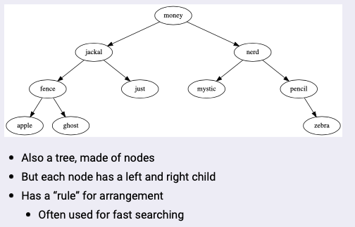

Super efficient for binary search.

## javascript_implementation_BST

```javascript
class BinarySearchNode {
  constructor(val, left = null, right = null) {
    this.val = val;
    this.left = left;
    this.right = right;
  }

  search(sought) {
    let currentNode = this;
    while (currentNode) {
      if (currentNode.val === sought) return currentNode;
      if (currentNode.val > sought) {
        currentNode = currentNode.left;
      } else {
        currentNode = currentNode.right;
      }
    }
  }
}

class BinarySearchTree {
  constructor(root = null) {
    this.root = root;
  }
}

const E = new BinarySearchNode('E');
const A = new BinarySearchNode('A');
const B = new BinarySearchNode('B');
const C = new BinarySearchNode('C');
const D = new BinarySearchNode('D');
const F = new BinarySearchNode('F');
const G = new BinarySearchNode('G');

E.left = B;
E.right = G;
B.left = A;
B.right = D;
G.left = F;

const josh = new BinarySearchTree(E);

E.search('D'); // BinarySearchNode {val: "D", left: null, right: null}
```

---

# maps

Are an abstract data type for mapping key -> value pairs. They are present in most langagues:

Javascript: Map and Object {}
Python: dict
Ruby: Hash
Java: HashMap
Go: Map

Javascript Objects store keys always as strings. Javascript Maps allows to store different data types as keys.

## maps_standard_methods

- set(key, val)
  Sets key to val
- get(key)
  Retrieve values for key
- delete(key)
  Delete entry for key
- has(key)
  Is there an entry for key?
- keys()
  Iterable keys
- values()
  Iterable values
- entries()
  Iterable key/vaue pairs.

# hash_tables

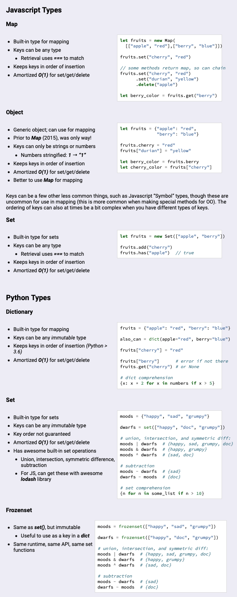

Are a key->value pair structures implemented through a hash function.

Hash tables has two parts:

1. an array (buckets to store the data)
2. a mapping function / hash function (the function that will determine the sorting algorithm in which store the data and that will be used to retrieve the data). Take a string -> hash it all or a part of it -> get a numeric value from the hashing function, use this number as an index to store the string in the table.

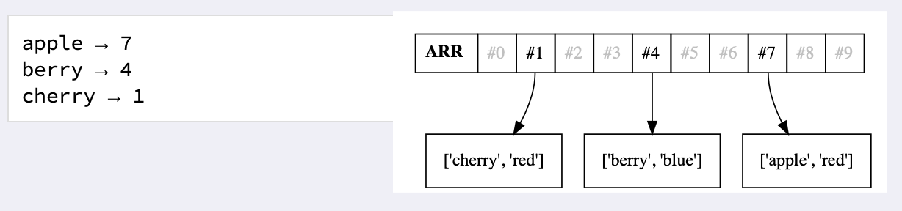
MAPPING: stablish a relationship between two sets of data.

We use them to implement our mapping in a very efficient way, we can search in O(1)!!! Because we don't have to loop over each item of the array, instead we run the hash function (that has always the same runtime), and that function will give us the array position at which the desired value is stored, and will also stablish the logic in which values will be distributed in the array.

## hash_tables_runtime

- Set O(1)
- get, has mostly O(1)
- delete mostly O(1)
- keys, values, entries O(n)

"Mostly" means that assuming there are no collisions, but collisions are unavoidable. The strategy to achieve most constant time as possible is

- choosing array size large enough to minimoze collisions.
- Choosing hash functions that spreads keys evenly in array.
- Resizing. Array shrink/grow, often aiming to keep it ~75% occupied. This means that some .set() and .delete() calls will take longer. If shrink/grown by proportion (eg double/halve), will be "amortized O(1)".

### hashing

Can find perfect hashing function if you know the data you have to store.

Hash function to store books in a bookshelf:

```javascript
function bookHashing(bookTitle, hashTableSize) {
  // Remove any spaces from book title.
  var strippedBookTitle = bookTitle.replace(/\s/g, '');
  // Divide the length of the title by the hash table size.
  // Return the remainder.
  return strippedBookTitle.length % hashTableSize;
}

bookHashing('The Grapes of Wrath', 12);
// 4
bookHashing('The Sound and the Fury', 12);
// 6
```

Hash function using Horner's method:

```javascript
function hash(key) {
  const arr_size = 7;
  // Prime number to use with Horner's method
  const H_PRIME = 31;

  let numKey = Array.from(key).reduce(
    (accum, char) => accum * H_PRIME + char.charCodeAt(),
    0
  );
  return numKey % arr_size;
}

hash('lala'); // 3
```

Hash function for hashing tables must:

- Be deterministic. Return the same output if the input is the same.
- Be fast. (Oposite to cryptologic hashes, like Bcrypt that is purposedly slow, because it prioritizes the difficulty of reversing output.) For hash tables, the hashing function has to be fast.
- Must give a wide distribution of the values in the table, so we will have as few collisions as possible.

### hash_runtime

- The amount of work used to hash a key isn't related to the number of items in the map, instead, it's related to the size of the key we're passing in the hash function, so the runtime will be O(k), where 'k' is the number of characters-in-string. Usually they use part of string (eg first 100 characters), these then could be O(1).
  Will be O(1) to find, set, etc.

### collisions

When the hashing function gives us the same index position for two different values, there's a collision, we're storing two things in the same bucket. To manage this, there are two different strategies:

1. **Separate Chaining**
   - Option a. : Each bin is an array of [key, value]:
     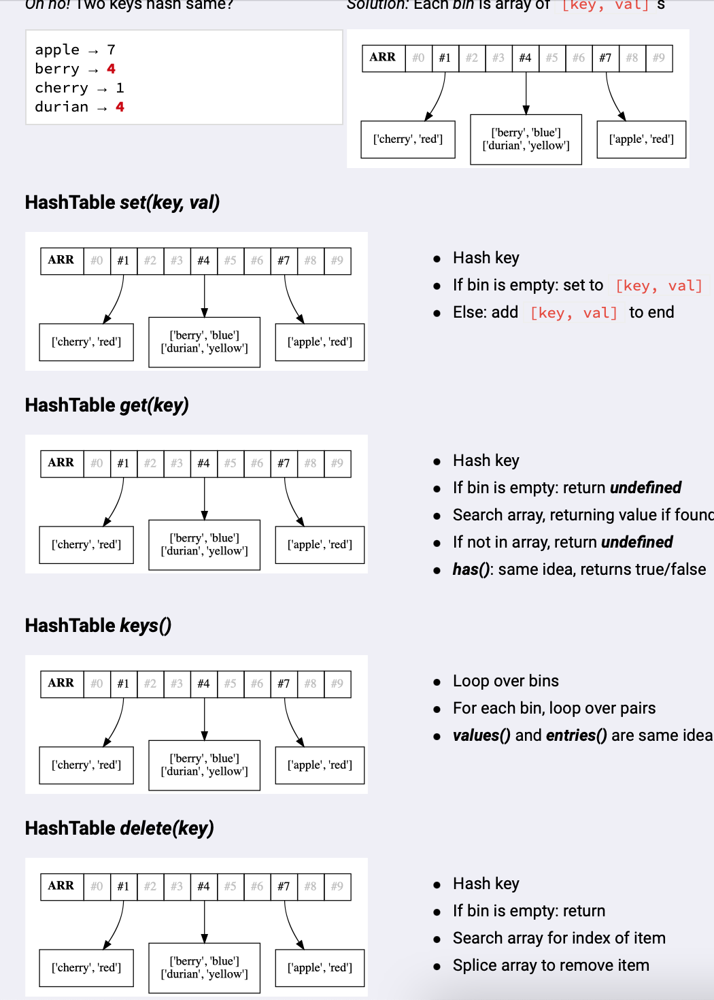
     Keep two or three arrays per bucket.
   - Option b: Each bucket is a linked list: https://visualgo.net/en/hashtable
2. **Open Addressing**
   - We can make each bin just a single [key, value] pair
   - If collision: look at the “next” place, this can be the next bin (this is _linear probing_)
   - Or there are smarter algorithms to reduce clumping
   - We should keep array size large enough to minimize when this happens
   - If we do and we have a good hash function, we can get amortized O(1)
3. **Double Hashing**

---

# stacks

Are a limited data structure. It does just two operations:

- insert
- remove

It's like a stack of books. Add a book at the top, and remove from the top (last in firts out)

<a name="Constraints_stacks"></a>

## Constraints_stacks

- Items added only by pushing them onto the top
- Items removed only by popping them off the top
  So newer items are near top of stack, older items are near the bottom
- LIFO (Last-in, first-out)

<a name="Standard_methods_stacks"></a>

## Standard_methods_stacks

- push(item)
  Add to “top” of stack
- pop()
  Remove & return top item
- peek()
  Return (but don’t remove) top item
- isEmpty()
  Are there items in the stack?

<a name="Efficient_Implementations_stacks"></a>

## Efficient_Implementations_stacks

- Array: yes, both push & pop are O(1)
- Linked List: only adding to the beginning is O(1), don't touch the end, because removing from the end in a Linked List is O(n)
- Doubly Linked List: yes, both push & pop are O(1)
- Object: no, popping is O(n) (have to scan whole obj to find high key)

<a name="Example_implementation_stacks"></a>

#### Example_implementation_stacks

```javascript
// Using Linked List:

/** Node: node for a stack. */

class Node {
  constructor(val) {
    this.val = val;
    this.next = null;
  }
}

/** Stack: chained-together nodes where you can
 *  remove from the top or add to the top. */

class Stack {
  constructor() {
    this.first = null;
    this.last = null;
    this.size = 0;
  }

  /** push(val): add new value to end of the stack. Returns undefined. */

  push(val) {
    let newNode = new Node(val);
    if (this.first === null) this.first = newNode;
    newNode.next = this.first;
    this.first = newNode;
    this.size++;
    if (this.size < 2) this.last = this.first.next;
  }

  /** pop(): remove the node from the top of the stack
   * and return its value. Should throw an error if the stack is empty. */

  pop() {
    if (this.size === 0) throw new Error('stack is empty');
    let val = this.first.val;
    this.first = this.first.next;
    this.size--;
    if (this.size < 2) this.last = this.first.next;
    return val;
  }

  /** peek(): return the value of the first node in the stack. */

  peek() {
    if (this.size > 0) return this.first.val;
  }

  /** isEmpty(): return true if the stack is empty, otherwise false */

  isEmpty() {
    return true ? this.size === 0 : false;
  }
}

module.exports = Stack;

const books = new Stack();
books.push('lole');
books.push('sara');
books.push('mina');
console.log(books);
books.pop();
console.log(books);

// --------------------------------------------------------------
// using javascript array:

const myMagazines = [];

myMagazines.push('vogue');
myMagazines.push('el grafico');
myMagazines.push('para ti');

myMagazines; // ["vogue", "el grafico", "para ti"]

myMagazines.pop(); // "para ti"
myMagazines.pop(); // "el grafico"
myMagazines; // [vogue]
```

---

# queues

- add at the end
- remove from the begining

<a name="Constraints_queues"></a>

## Constraints_queues

- Enqueueing: items are added to a queue ONLY at the end.
- Dequeueing: items are removed ONLY at the front.
  So newer items will always be at the back of the queue, and older items near the start.
- FIFO data structure (first in first out)

<a name="Standard_methods_queues"></a>

## Standard_methods_queues

- enqueue(item) / (sometimes called push)
  add to end
- dequeue(item) / (sometimes called pop)
  remove & return first item
- peek()
  Return first item, don't remove it
- isEmpty()
  Are there items in queue?
- .length()

<a name="##Efficient_Implementations_queues"></a>

## Efficient \_Implementations_queues

- Linked List: yes, both enqueue & dequeue are O(1) (we can keep track of the head and the tail of the LL)
- Doubly Linked List: yes, both enqueue & dequeue are O(1)
- Array: no, dequeing would be O(n)
- Object: no, dequeuing is O(n) (have to scan whole obj to find low key)

<a name="Example_implementation_queues"></a>

## Example_implementation_queues

```javascript
// Implement a queue data structure in Javascript

/** Node: node for a queue. */

class Node {
  constructor(val) {
    this.val = val;
    this.next = null;
  }
}

/** Queue: chained-together nodes where you can
 *  remove from the front or add to the back. */

class Queue {
  constructor() {
    this.first = null;
    this.last = null;
    this.size = 0;
  }

  /** enqueue(val): add new value to end of the queue. Returns undefined. */

  enqueue(val) {
    let newNode = new Node(val);
    if (this.first === null) this.first = newNode;
    if (this.last !== null) this.last.next = newNode;
    this.last = newNode;
    this.size++;
  }

  /** dequeue(): remove the node from the start of the queue
   * and return its value. Should throw an error if the queue is empty. */

  dequeue() {
    if (this.size === 0) throw new Error('queue is empty');
    let val = this.first.val;
    this.first = this.first.next;
    this.size--;
    if (this.size < 2) this.last = this.first;
    return val;
  }

  /** peek(): return the value of the first node in the queue. */

  peek() {
    if (this.size > 0) return this.first.val;
    return null;
  }

  /** isEmpty(): return true if the queue is empty, otherwise false */

  isEmpty() {
    if (this.size === 0) return true;
    return false;
  }
}

module.exports = Queue;

const line = new Queue();
console.log(line.enqueue('tito'));
console.log(line.enqueue('carlo'));
console.log(line.enqueue('beto'));
console.log(line);
// console.log(line.peek());
// console.log(line.dequeue());

// -------------------------------------------------
// ALTERNATE APROACH
class Node {
  constructor(val) {
    this.val = val;
    this.next = null;
  }
}

class LinkedList {
  constructor() {
    this.head = null;
    this.tail = null;
  }
}

class Queue {
  constructor() {
    this.data = new LinkedList();
  }

  push(val) {
    let newNode = new Node(val);
    if (this.data.head === null) this.data.head = newNode;
    if (this.data.tail !== null) this.data.tail.next = newNode;
    this.data.tail = newNode;
    this.data.length++;
  }

  pop() {
    let val = this.data.head.val;
    this.data.head = this.data.head.next;
    this.data.length -= 1;
    if (this.data.length < 2) this.data.tail = this.data.head;
    return val;
  }
}

const waitList = new Queue();
waitList.log();
waitList.push('Tom');
waitList.push('Susan');
console.log(waitList.pop()); //tom
```

---

# deques

Pronounce "decks"
"Double Ended Queue".

- push
- pop
- shift
- unshift

# Constraints_deques

- Can add item to the beginning
- Can remove from the beginning
- Can add to the end
- Can remove from the end

## Standard_methods_deques

- appendleft()
  Add to beginning
- appendright()
  Add to end
- popleft()
  Remove & return from beginning
- popright()
  Remove & return from end
- peekleft()
  Return (don’t remove) beginning
- peekright()
  Return (don’t remove) end
- isEmpty()
  Are there items in the deque?

## Efficient_Implementations_deques

- Doubly Linked List: yes — everything is O(1)
- Linked List: no, popright would be O(n)
- Array: no, appendleft & popleft would be O(n)
- Object: no, popleft & popright would be O(n)

# Example_implementation_deques

Not provided today

---

# heaps

Efficient way of implementing a priority queue. As we insert a value, the heap reorganizes in the correct spot, ant it makes very easy to retrieve the highest value, which is always at the top or the bottom.

# Constraints_heaps

## Standard_methods_heap)

## Efficient_Implementations_heap)

# Example_implementation_heaps

---

# priority_queues

It's an ADT for a collection.

- Add item (with priority)
- Remove highest priority item.

# Constraints_P_queues

- Add item with priority
- Remove item with highes priority first

## Standard_methods_P_queues

- add(pri, item)
  Add item to queue
- poll()
  Remove & return top-priority item
- peek()
  Return (don’t remove) top-priority item
- isEmpty()
  Are there items in queue?

## Efficient_Implementations_P_queues

Two strategies:

1. Keep sorted, add at right place, top priority is first.
   - Array: no, add & poll would be O(n)
   - Linked List: no, add would be O(n)
   - Doubly Linked List: no, add would be O(n)
2. Keep unsorted, add to end, find top priority on poll.
   - Array: no, peek and poll would be O(n)
   - Linked List: no, add would be O(n)
   - Doubly linked list: no, peek & poll would be O(n)

# Example_implementation_P_queues

---

# lists

Are an abstract data type accross languages that can:

Constraints:

- Keep multiple items
- Can insert or delete items at any position
- Can contain duplicates
- Preserves order of items

They have two implementations: arrays and linked lists.

<a name="linked_lists"></a>

## linked_lists

Not built in in Javascript, we have to implement it:

```javascript
class Node {
  constructor(val) {
    this.val = val;
    this.next = null;
  }
}

class LinkedList {
  constructor() {
    this.head = null;
    this.tail = null;
  }

  push(val) {
    // adds node at the end of list
    let newNode = new Node(val);
    if (this.head === null) this.head = newNode;
    if (this.tail !== null) this.tail.next = newNode;
    this.tail = newNode;
    return this;
  }

  find(val) {
    // finds given value in list, => true/false
    let current = this.head;
    while (current !== null) {
      if (current.val === val) return true;
      current = current.next;
    }
    return false;
  }

  traverse() {
    // prints val and next of each node
    let current = this.head;
    while (current !== null) {
      console.log(current.val);
      current = current.next;
    }
  }
}

const insects = new LinkedList();
// insects.head = antNode;

// use methods:
insects.push('ant');
insects.push('bee');
insects.push('caterpillar');
insects.push('dragonfly');
insects.push('wasp');

insects.traverse(); // ant, bee, caterpillar, dragonfly

insects.find('fly'); // false
insects.find('bee'); // true

// -----------------------------------------------------------------
// MORE EQUIPPED EXAMPLE:

/** Node: node for a singly linked list. */

class Node {
  constructor(val) {
    this.val = val;
    this.next = null;
  }
}

/** LinkedList: chained together nodes. */

class LinkedList {
  constructor(vals = []) {
    this.head = null;
    this.tail = null;
    this.length = 0;

    for (let val of vals) this.push(val);
  }

  /** push(val): add new value to end of list. */

  push(val) {
    let newNode = new Node(val);
    if (this.head === null) this.head = newNode;
    if (this.tail !== null) this.tail.next = newNode;
    this.tail = newNode;
    this.length++;
  }

  /** unshift(val): add new value to start of list. */

  unshift(val) {
    let newNode = new Node(val);
    if (this.head === null) this.head = newNode;
    newNode.next = this.head;
    this.head = newNode;
    if (this.tail === null) this.tail = this.head.next;
    this.length++;
  }

  traverse() {
    // prints val and next of each node
    let current = this.head;
    while (current !== null) {
      console.log(current.val);
      current = current.next;
    }
  }

  /** pop(): return & remove last item. */

  pop() {
    return this.removeAt(this.length - 1);
  }

  /** shift(): return & remove first item. */

  shift() {
    return this.removeAt(0);
  }

  /** getAt(idx): get val at idx. */

  getAt(idx) {
    let cur = this.head;
    let count = 0;
    while (cur !== null && count <= idx) {
      if (count === idx) {
        return cur.val;
      }
      count++;
      cur = cur.next;
    }
    return null;
  }

  /** setAt(idx, val): set val at idx to val */

  setAt(idx, val) {
    let cur = this.head;
    let count = 0;
    while (cur !== null && count <= idx) {
      if (count === idx) {
        cur.val = val;
      }
      count++;
      cur = cur.next;
    }
  }

  /** insertAt(idx, val): add node w/val before idx. */

  insertAt(idx, val) {
    const newNode = new Node(val);

    if (idx > this.length || idx < 0) {
      throw new Error('Invalid index.');
    }

    if (idx === 0) return this.unshift(val);
    if (idx === this.length) return this.push(val);

    let prev = this._get(idx - 1);

    newNode.next = prev.next;
    prev.next = newNode;

    this.length += 1;
  }

  removeAt(idx) {
    if (idx >= this.length || idx < 0) {
      throw new Error('invalid index.');
    }

    // case remove first item:
    if (idx === 0) {
      let val = this.head.val;
      this.head = this.head.next;
      this.length -= 1;
      if (this.length < 2) this.tail = this.head;
      return val;
    }

    let prev = this._get(idx - 1);

    // case remove tail:
    if (idx === this.length - 1) {
      let val = prev.next.val;
      prev.next = null;
      this.tail = prev;
      this.length -= 1;
      return val;
    }

    // case remove in the middle:
    let val = prev.next.val;
    prev.next = prev.next.next;
    this.length -= 1;
    return val;
  }

  /** average(): return an average of all values in the list */

  average() {
    if (this.length === 0) return 0;
    let values = 0;
    let cur = this.head;
    while (cur !== null) {
      values += cur.val;
      cur = cur.next;
    }
    return values / this.length;
  }

  _get(idx) {
    let cur = this.head;
    let count = 0;

    while (cur !== null && count != idx) {
      count += 1;
      cur = cur.next;
    }
    return cur;
  }
}

// USE METHODS:
const people = new LinkedList();
people.push('tammy');
people.push('sonia');
people.push('peter');
people.unshift('Rolo!!!');
people.traverse();
people.pop();
console.log(people.average());
```

Check steps in visualgo: https://visualgo.net/en/list
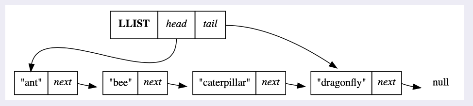

Nodes aren’t stored in contiguous memory; instead, each item references the next item in the sequence.Can rearrange without having to move other nodes in memory. It's more efficient than an array if we have to rearrange or move thins around. In an array we would have to shift over every element to insert a new item. In a linked list, we just change the references, and it's constant time. Although is not that efficient for a search by position.

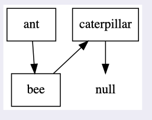

They are linear data structures: there is a sequence and an order to how they are constructed and traversed:
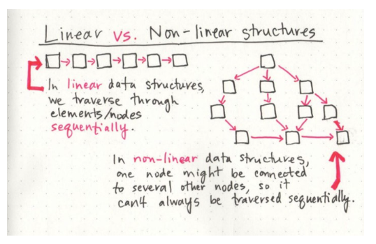

<a name="runtime_ll"></a>

### runtime of linked lists

- Going to “next” item: O(1)
- Insert node at the beginning: O(1)
- Insert node at end: O(1) if known tail; O(n) if unknown;
- Deleting at start: O(1)
- Deleting at end: O(n) (because nodes desn't know "previous" value)
- Going to item by arbitrary index: O(n)
- Searching for value: O(n)
- General insertion or deletion in the middle of list: O(n)

## douubly_linked_lists

Each node has a "next" and a "previous".

Same principles as the linked lists, except that has the "previous" value. Allows us to traverse backwards, and makes easier to insert in the middle and to delete at the end of list. Can remove from the end in O(1), because can go to the tail, find the previous node and make it tail. The downsize is that you have to update next and previous every time, and you use more space in memory.

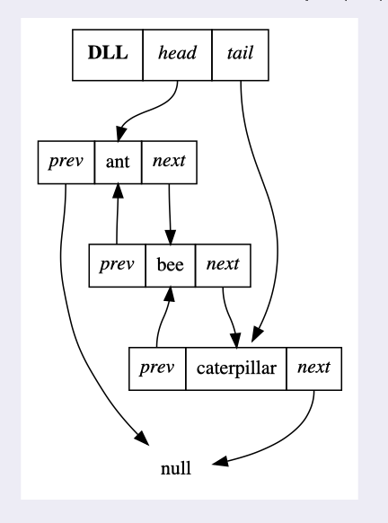

## Nodes

The basic unit in a linked list is a node. A basic node has two attributes:

- val (can be string, int, instance, anything)
- next (reference to the next node, if last item, reference to null)

```javascript
class Node {
  constructor(val) {
    this.val = val;
    this.next = null;
  }
}

let antNode = new Node('ant');
let beeNode = new Node('bee');
let caterpillarNode = new Node('caterpillar');

antNode.next = beeNode;
beeNode.next = caterpillarNode;

// ALTERNATIVE IMPLEMENTATION, ADDING THE NEXT NODE AS ARGUMENT:
class Node {
  constructor(val, next = null) {
    this.val = val;
    this.next = next;
  }
}

let antNode = new Node('ant', new Node('bee', new Node('caterpillar')));
```

## arrays

### array_runtimes

- Retrieving by index: O(1)
- Searching: O(n)
- General insertion: O(n) (because all things in array have to be shifted over)
- General deletion: O(n) (all things have to be reaccomodated)
- append to start: O(1)
- append to end: O(1)

Arrangement of items at equally-spaced addresses in memory:

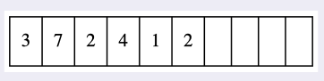

### indirect_arrays

Javascript uses indirect arrays.
In any indirect array, the array doesn’t directly hold the value. It holds the memory address of the real value. This lets an array store different types of data, or different length data.

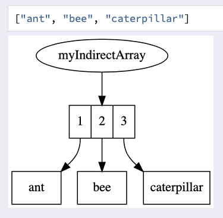

### direct_arrays/vectors

It's a special kind of array. IT ONLY WORKS IF ITEMS ARE ALL THE SAME SIZE:

- all numbers
- all same-length strings

### typed_arrays

Javascript typed arrays are more powerful when working with big loads of data. (numbers, music/video data, etc.)
It's a javascript version of vectors. Used very rarely. They have restrictions on what can be stored in them. (checkout mdn for more)

---

# recursion

MUST HAVE:

- BASE CASE
- PROGRESS

  Functions that calls themselves.
  “In order to understand recursion, one must first understand recursion."

When you call a function, you “freeze” where you are until that function returns, and then continue where you left off.

## examples

```javascript
// NESTED ARRAY
// PRINT EVERY VALUE IN ARRAY, DOUBLED
data = [ 1, [2, [3], 4], 5 ]

function doubler(nums) {
  for (let n of nums) {
    if Array.isArray(n) {
      doubler(n);
    } else {
      console.log(n * 2);
    }
  }
}

// --------------------------------------------------------
// NESTED OBJECT
function gatherStrings(obj, result = []) {
  const values = Object.values(obj);
  for (let val of values) {
    if (typeof val === 'string') result.push(val);
    if (typeof val === 'object') {
      gatherStrings(val, result);
    }
  }
  return result;
}

let nestedObj = {
  firstName: 'Lester',
  favoriteNumber: 22,
  moreData: {
    lastName: 'Testowitz',
  },
  funFacts: {
    moreStuff: {
      anotherNumber: 100,
      deeplyNestedString: {
        almostThere: {
          success: 'you made it!',
        },
      },
    },
    favoriteString: 'nice!',
  },
};

console.log(gatherStrings(nestedObj)); // ["Lester", "Testowitz", "you made it!", "nice!"];

// ---------------------------------------------------------------------
// BINARY SEARCH
/** given a sorted array of numbers, and a value,
 * return the index of that value (or -1 if val is not present). */

function binarySearch(arr, val, startIdx = 0, endIdx = arr.length - 1) {
  if (
    startIdx < 0 ||
    startIdx > arr.length - 1 ||
    endIdx < 0 ||
    endIdx > arr.length - 1
  )
    return -1;
  const midIdx = Math.floor((startIdx + endIdx) / 2);
  let midVal = arr[midIdx];
  if (midVal === val) return midIdx;
  if (midVal < val) return binarySearch(arr, val, midIdx + 1, arr.length - 1);
  if (midVal > val) return binarySearch(arr, val, midIdx - 1, 0);
}
binarySearch([1,2,3,4],1) // 0
binarySearch([1,2,3,4],3) // 2
binarySearch([1,2,3,4],5) // -1

// ------------------------------------------------------------------------

/** product: calculate the product of an array of numbers. */

function product(nums, idx = 0) {
  if (idx === nums.length) return 1;
  return nums[idx] * product(nums, idx + 1);
}
product([2, 2, 2]); // 8

/** longest: return the length of the longest word in an array of words. */

function longest(words, idx = 0, winner = 0) {
  if (idx === words.length) return winner;
  if (words[idx].length > winner) winner = words[idx].length;
  return longest(words, idx + 1, winner);
}

/** everyOther: return a string with every other letter. */

function everyOther(str, idx = 0, result = '') {
  if (idx > str.length - 1) return result;
  result += str[idx];
  return everyOther(str, idx + 2, result);
}

/** isPalindrome: checks whether a string is a palindrome or not. */

function isPalindrome(str, idxForwards = 0, idxBackWards = str.length - 1) {
  if (idxForwards > str.length) return true;
  if (str[idxForwards] === str[idxBackWards]) {
    return isPalindrome(str, idxForwards + 1, idxBackWards - 1);
  }
  return false;
}

/** findIndex: return the index of val in arr (or -1 if val is not present). */

function findIndex(arr, val, idx = 0) {
  if (idx > arr.length) return -1;
  if (arr[idx] === val) return idx;
  return findIndex(arr, val, idx + 1);
}

/** revString: return a copy of a string, but in reverse. */

function revString(str, idx = str.length - 1, result = '') {
  if (idx === -1) return result;
  result += str[idx];
  return revString(str, idx - 1, result);
}

/** gatherStrings: given an object, return an array of all of the string values. */

function gatherStrings(obj, result = []) {
  const values = Object.values(obj);
  for (let val of values) {
    if (typeof val === 'string') result.push(val);
    if (typeof val === 'object') {
      gatherStrings(val, result);
    }
  }
  return result;
}

/** Write a function called findFloor which accepts a sorted array and a value x,
and returns the floor of x in the array. The floor of x in an array is the largest element
in the array which is smaller than or equal to x. If the floor does not exist, return -1. */

function findFloor(arr, num, low = 0, high = arr.length - 1) {
  if (low > high) return -1;
  if (num >= arr[high]) return arr[high];

  let mid = Math.floor((low + high) / 2)

  if (arr[mid] === num) return arr[mid];

  if (mid > 0 && arr[mid - 1] <= num && num < arr[mid]) {
    return arr[mid - 1];
  }

  if (num < arr[mid]) {
    return findFloor(arr, num, low, mid - 1);
  }

  return findFloor(arr, num, mid + 1, high)
}

module.exports = findFloor
// ---------------------------------------------------------

```

## runtime

In general O(n), and can be worst:

```javascript
function sum(nums, i = 0) {
  if (i === nums.length) return 0;

  return nums[i] + sum(nums, i + 1);
}
// O(n)

function evens(nums) {
  let out = [];

  function _evens(nums, i) {
    if (nums.length === i) return;
    if (nums[i] % 2 === 0) out.push(nums[i]);
    _evens(nums, i + 1);
  }

  _evens(nums, 0);
  return out;
}
//O(n)
```

### explicit_base_case

```javascript
function count(n = 1) {
  if (n > 3) return;

  console.log(n);
  count(n + 1);
}
```

### hidden_base_case

```javascript
function count(n = 1) {
  if (n <= 3) {
    console.log(n);
    count(n + 1);
  }
}
// implicitly will return undefined if the condition is not meeted.
```

### degenerate_case

degenerate case: A “degenerate case” is one that is so reduced that it’s fundamentallydifferent from the others and would need to be treated differently.

```javascript
// Consider counting up to 3 recursively:
function count(n = 1) {
  if (n > 3) return;
  console.log(n);
  count(n + 1);
}
/**
 Here, our base case is “when we hit 3, don’t keep recursing”. This is a base case, but it’snot “degenerate” — we could keep counting up after 3; there’s nothing preventing us fromdoing so besides our goal to stop. Compare this with finding the length of a listrecursively:*/
function lenlist(nums) {
  if (nums[0] === undefined) return 0;
  return 1 + lenlist(nums.slice(1));
}
/** Here, our base case is “the length of an empty list is 0, so return that and don’trecurse”. This base is “degenerate” — there’s no possible way for us to find the length of alist with -1 items in it! It wouldn’t even be possible for us to keep recursing; this basecase is a hard limit on what’s possible. Not all recursive problems have a degenerate basecase, but thinking about if one is possible is often helpful in figuring what your base caseis and how the recursion should work.*/
```

## recursion_vs_loops

Any loop can replace recursion, any recursive implementation can be replaced by a loop. Performance differs and syntax simplicity.

Count using recursion:

```javascript
function count(n = 1) {
  if (n > 3) return; // Base Case. Returning clears the call stack one call at a time, top to bottom.

  console.log(n);
  count(n + 1); // recursion.
  // this will be printed after the return:
  console.log('lala')
}
}

count();
```

Count using a loop:

```javascript
function count() {
  let n = 1;

  while (n <= 3) {
    console.log(n);
    n += 1;
  }
}

count();
```

---

# Divide-and-conquer-strategy

A problem solving strategy, will apply it for searching algorithms, aiming to optimize time complexity.
The genearl pattern is: given a data set, a divide and conquer algorithm removes a large fraction of the data set from consideration at each step. The data set must have some additional structure (e.g be sorted). Significantly improves time complexity, when it's applicable.

## examples

```javascript
/**findRotatedIndex

Write a function called findRotatedIndex which accepts a rotated array of sorted numbers and an integer. The function should return the index of num in the array. If the value is not found, return -1.

Constraints:

Time Complexity: O(log N) */

function findRotatedIndex(arr, val) {
  let middleIdx = findMiddleIdx(arr);
  let highestValIdx = findHighestValIdx(arr);
  const middleVal = arr[middleIdx];
  if (middleVal === val) {
    return middleIdx;
  } else if (middleVal > val && arr[0] > val) {
    return binarySearch(arr, highestValIdx + 1, arr.length - 1, val);
  } else {
    return binarySearch(arr, 0, highestValIdx, val);
  }
}

function findMiddleIdx(arr, startIdx = 0, endIdx = arr.length - 1) {
  return Math.floor((startIdx + endIdx) / 2);
}

function findHighestValIdx(arr) {
  let start = 0;
  let end = arr.length - 1;
  while (start <= end) {
    const middle = findMiddleIdx(arr, start, end);
    if (arr[middle] > arr[middle + 1]) return middle;
    else if (arr[start] <= arr[middle]) {
      start = middle + 1;
    } else {
      end = middle - 1;
    }
  }
}

function binarySearch(arr, start, end, val) {
  if (start >= 0 && end <= arr.length - 1) {
    while (start <= end) {
      let middleIdx = Math.floor((start + end) / 2);
      if (arr[middleIdx] === val) {
        return middleIdx;
      } else if (val < arr[middleIdx]) {
        end = middleIdx - 1;
      } else {
        start = middleIdx + 1;
      }
    }
  }
  return -1;
}

// findRotatedIndex([3,4,1,2],4)
findRotatedIndex([6, 7, 8, 9, 1, 2, 3, 4], 8);
// findRotatedIndex([6, 7, 8, 9, 1, 2, 3, 4], 8)
// findRotatedIndex([6, 7, 8, 9, 1, 2, 3, 4], 3);
// findRotatedIndex([37,44,66,102,10,22],14)
// findRotatedIndex([6, 7, 8, 9, 1, 2, 3, 4], 12)

// ------------------------------------------------------------
/** findRotationCount

Write a function called findRotationCount which accepts an array of distinct numbers sorted in increasing order. The array has been rotated counter-clockwise n number of times. Given such an array, find the value of n.

Constraints:

Time Complexity: O(log N)

*/

function findRotationCount(arr) {
  if (arr[0] < arr[arr.length - 1]) return 0;

  const highestValueIdx = findHighestValueIdx(arr);
  return binaryCount(arr, 0, highestValueIdx);
}

function binaryCount(arr, start, end) {
  let count = 0;
  while (start < end) {
    const middle = Math.floor((start + end) / 2);
    console.log(middle);
    count++;
    end -= 1;
  }
  return count + 1;
}

function findHighestValueIdx(arr) {
  let start = 0;
  let end = arr.length - 1;
  while (start <= end) {
    let middle = Math.floor((start + end) / 2);
    if (arr[middle] > arr[middle + 1]) return middle;
    else if (arr[start] <= arr[middle]) {
      start = middle + 1;
    } else {
      end = middle - 1;
    }
  }
}

/**
   * SOLUTION:
   function findRotationCount(arr, low = 0, high = arr.length - 1) {
    if (high < low) return 0;
    if (high === low) return low;
    let mid = Math.floor((low + high) / 2)
  
    // Check if element (mid+1) is minimum element.
    // Consider the cases like [3, 4, 5, 1, 2]
    if (mid < high && arr[mid + 1] < arr[mid])
      return mid + 1;
  
    // Check if mid itself is minimum element
    if (mid > low && arr[mid] < arr[mid - 1]) {
      return mid;
    }
  
    // Decide whether we need to go to left half or
    // right half
    if (arr[high] > arr[mid]) {
      return findRotationCount(arr, low, mid - 1);
    }
  
    return findRotationCount(arr, mid + 1, high);
  }
  
  // findRotationCount([15, 18, 2, 3, 6, 12]) 
  findRotationCount([7, 9, 11, 12, 5]) 
   */

findRotationCount([15, 18, 2, 3, 6, 12]);
// findRotationCount([7, 9, 11, 12, 5])
// findRotationCount([7, 9, 11, 12, 15])

// -----------------------------------------------------------
/**Given an array of 1s and 0s which has all 1s first followed by all 0s, write a function called countZeroes, which returns the number of zeroes in the array. */

function countZeroes(arr) {
  let firstZero = findFirst(arr);
  if (firstZero === -1) return 0;

  return arr.length - firstZero;
}

function findFirst(arr, low = 0, high = arr.length - 1) {
  if (high >= low) {
    let mid = low + Math.floor((high - low) / 2);
    if ((mid === 0 || arr[mid - 1] === 1) && arr[mid] === 0) {
      return mid;
    } else if (arr[mid] === 1) {
      return findFirst(arr, mid + 1, high);
    }
    return findFirst(arr, low, mid - 1);
  }
  return -1;
}

module.exports = countZeroes;

/**Given a sorted array and a number, write a function called sortedFrequency that counts the occurrences of the number in the array

Constraints:

Time Complexity: O(log N) */
function sortedFrequency(arr, num) {
  let firstIdx = findFirst(arr, num);
  if (firstIdx == -1) return firstIdx;
  let lastIdx = findLast(arr, num);
  return lastIdx - firstIdx + 1;
}

function findFirst(arr, num, low = 0, high = arr.length - 1) {
  if (high >= low) {
    let mid = Math.floor((low + high) / 2);
    if ((mid === 0 || num > arr[mid - 1]) && arr[mid] === num) {
      return mid;
    } else if (num > arr[mid]) {
      return findFirst(arr, num, mid + 1, high);
    } else {
      return findFirst(arr, num, low, mid - 1);
    }
  }
  return -1;
}

function findLast(arr, num, low = 0, high = arr.length - 1) {
  if (high >= low) {
    let mid = Math.floor((low + high) / 2);
    if ((mid === arr.length - 1 || num < arr[mid + 1]) && arr[mid] === num) {
      return mid;
    } else if (num < arr[mid]) {
      return findLast(arr, num, low, mid - 1);
    } else {
      return findLast(arr, num, mid + 1, high);
    }
  }
  return -1;
}

module.exports = sortedFrequency;
```

More examples: /Users/xxx/projects/demos/ADS/divide-conquer

## binary_search

O(log n) time complexity.
Better time complexity, but ONLY FOR SORTED ARRAYS.

- Look at the middle value is the one we're searching for, return.
- If middle value too big, eliminate every value to the right.
- If millde value too small, eliminate every value to the left.

```javascript
function binarySearch(arr, val) {
  let leftIdx = 0;
  let rightIdx = arr.length - 1;

  while (leftIdx <= rightIdx) {
    // find the middle value
    let middleIdx = Math.floor((leftIdx + rightIdx) / 2);
    let middleVal = arr[middleIdx];

    if (middleVal < val) {
      // middleVal is too small, look at the right half
      leftIdx = middleIdx + 1;
    } else if (middleVal > val) {
      // middleVal is too large, look at the left half
      rightIdx = middleIdx - 1;
    } else {
      // we found our value!
      return middleIdx;
    }
  }
  // left and right pointers crossed, val isn't in arr
  return -1;
}
```

## linear_search

It's an O(n) algorithm, because we have to compare over each item of the array, we use it for not-sorted arrays:

```javascript
// custom indexOf implementation
function indexOf(arr, val) {
  for (let i = 0; i < arr.length; i++) {
    // if you find the value, return the index
    if (arr[i] === val) return i;
  }

  // if you never find the value, return -1
  return -1;
}

indexOf([4, 8, 15, 16, 23, 42], 15); // 2
indexOf([4, 8, 15, 16, 23, 42], 42); // 5
indexOf([4, 8, 15, 16, 23, 42], 100); // -1
```

# Big-O notation

## functions

f(n) can be:

- `O(1)` CONSTANT (f(n) = 1) (the line is flat)
- `O(n)` LINEAR (f(n) = n) (the line grows constantly and proportional to n)
- `O(n²)`EXPONENTIAL (f(n) = n²) (the line grows twice the increase of n)
- f(n) is something entirely different

These are all functions that describe a line. Checkout this linear calculator: https://www.desmos.com/calculator

Worst case always:
In big-O notation we always calculate over the worst case scenario. The function will execute the maximum number of times it can.

# time_complexity

- Airthmetic and mathematical operations are constant time.
  3 + 3 is always the same operation, doesn't matter the values, will always take the same amount of simple operations. If the values change, the operations will remain the same, so will be constant time.

  ```javascript
  function pucha(num) {
    return num + 223211 - 32 / 332;
  }
  // This will be O(1)
  ```

- Variable assingment is constant time.
  "const x1 = 3", doesn't matter the value of x1, because the variable will always take the same time to be processed (roughly)

  ```javascript
  function toto() {
    const x1 = 33243;
    const x2 = 432;
    const x3 = 3433;
  }
  // O(1)
  ```

- Accessing elements in array BY INDEX or object BY KEY is constant time

```javascript
function getThird(arr) {
  return arr[3];
}
// size of array doesn't matter.

function getKey(key) {
  return obj[key];
}
// size of object doesn't matter.
```

- Loops: no constant. To calculate the time complexity of a loop: take the length of the loop times complexity of whatever happens in loop.
  Can have loops with constant times or number of runs, nested loops also can be constant.

```javascript
function squareAndSumAll(arr) {
  for (let i = 0; i < arr.length; i++) {
    return arr[i] * arr[i] + arr[i];
  }
}
//We loop n times, inside the loop we perform 1 operation, so we simplify: O(n)
```

## space_complexity

How much memory or storage space is needed as the input increases. Is less common than time complexity.

Javascript manages storage with these principles:

- Booleans, numbers, undefined, null --> constant space.
- Strings: O(n) space [as n of characters grow, the storage needed grows.]
- Reference types (arrays, objects): generally, O(n), where n is the length of array, or keys in object.

Examples:

```javascript
function sum(nums) {
  let total = 0;

  for (let i = 0; i < nums.length; i++) {
    total += nums[i];
  }

  return total;
}

// SPACE COMPLEXITY: O(1)
// TIME COMPLEXITY: O(n)

// -----------------------------
function double(nums) {
  let doubledNums = [];

  for (let i = 0; i < nums.length; i++) {
    doubledNums.push(2 * nums[i]);
  }

  return doubledNums;
}
// O(n) space
```

## log

Examples in base 2:

`log₂8 = 3` How many time do I have to multiply the number 2 by itself to get 8 as a result? Three times (2*2 = 4; 4*2 = 8).

The logarithm of a number roughly measures the number of times you can divide that number by 2 before you get a value that's less than or equal to 1.
`log₂8 = 3` 8/2=4; 4/2=2; 2/2=1

Base 3:
`log₃81 = 4`


Best runtime for sorting is `O(n log₂n)` meaning "n times the logarithm of n".

## general


We use big-O notation to analyze the performance of an algorithm.

- can give high level understanding of time or space complexity.
- Desn't care about precision, only general trends (linear?, quadratic?, constant?)
- Depends only on algorithm, not hardware used to run code.
- Based on worst-case performance.

Big-O is based on the count of the number of simple operations the computer has to perform to complete the task. More operations, more time and resources.

Examples:

Algorithm 1:

```javascript
function addUpToSecond(n) {
  return (n * (n + 1)) / 2;
}
```

This algorithm runs in `O(1)`, constant time.
This is a `O(1)` function, a "big-O of one" function, meaning that "as the input increases, the number of operations it takes is eventually less than 1 (because it always returns n multiplied by n plus 1 divided by 2, so always operations only)."

Algorithm 2:

```javascript
function addUpToFirst(n) {
  let total = 0;

  for (let i = 1; i <= n; i++) {
    total += i;
  }

  return total;
}
```

This algorithm runs in O(n), linear time.

It's an `O(n)` "a big-O of n function", meaning that as n increases the function will employ an n amount of operations, because the loop will run every time while less than n.

Algorithm 3:

```javascript
function printAllPairs(n) {
  for (var i = 0; i < n; i++) {
    for (var j = 0; j < n; j++) {
      console.log(i, j);
    }
  }
}
```

This algorithm runs in `O(n²)`. The amount of time grows double times the value of n. Grows "quadratic times". No good.

To simplify your expressions, keep in mind two rules:

- Constants do not matter.
- Smaller terms do not matter.
